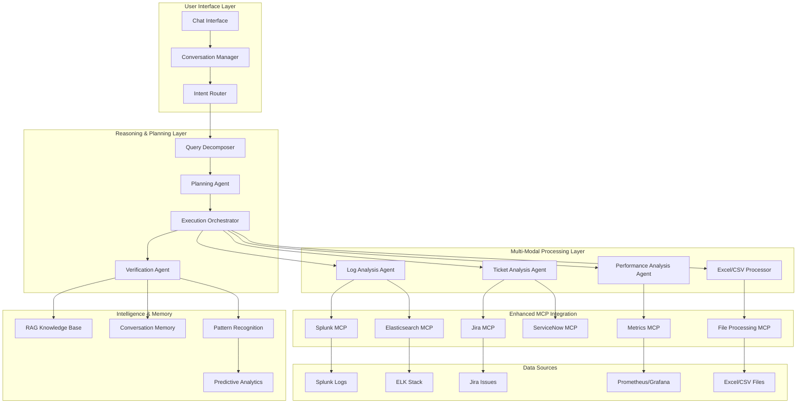

# Advanced Agentic System Architecture for Multi-Modal Analysis

## 🎯 Executive Summary

Building on your existing **Enhanced Correlation Client**, this document outlines the architecture for a **Claude Desktop-like agentic system** that can perform intelligent analysis across:

- **Log Analysis**: Splunk, Elasticsearch, CloudWatch, etc.
- **Ticket Management**: Jira, ServiceNow, GitHub Issues
- **Performance Analytics**: Excel files, CSV data, 90th percentiles, SLA metrics
- **Reasoning & Decision Making**: Multi-step analysis, root cause identification, trend prediction

**Key Differentiators from Current System:**

- **Conversational Memory**: Maintains context across multi-turn conversations
- **Planning & Execution**: Breaks down complex queries into executable steps
- **Multi-Modal Processing**: Handles Excel files, charts, logs, and structured data
- **Human-in-the-Loop**: Asks clarifying questions and confirms actions
- **Autonomous Reasoning**: Makes decisions based on evidence and patterns

---

## 🏗️ System Architecture

### Current State Analysis (What You Have)

Your existing `enhanced_correlation_client.py` provides:

```python
✅ LLM Integration (OpenAI GPT-4)
✅ MCP Protocol Support (Splunk HTTP/SSE, Jira Docker stdio)
✅ Semantic Correlation Engine
✅ Function Calling Architecture
✅ Basic Query Processing
✅ Confidence Scoring System
```

### What's Missing for Full Agentic Capabilities

```python
❌ Conversational State Management
❌ Multi-Step Planning & Execution
❌ Excel/CSV Processing Capabilities
❌ Performance Analytics Tools
❌ RAG Knowledge Base
❌ Human-in-the-Loop Workflow
❌ Multi-Modal Data Processing
❌ Persistent Memory System
```

### Enhanced Agentic Architecture



---

#### 1. **Extend Current Enhanced Correlation Client**

```python
# Build on your existing client
class AgenticEnhancedCorrelationClient(EnhancedCorrelationClient):
    """Enhanced version with full agentic capabilities"""

    def __init__(self):
        super().__init__()

        # Add new agentic components
        self.conversation_manager = ConversationManager()
        self.planning_agent = PlanningAgent(self.openai_client)
        self.performance_agent = PerformanceAnalysisAgent()
        self.rag_engine = EnhancedRAGEngine()

        # Enhanced MCP connections
        self.excel_processor = ExcelProcessorMCP()
        self.elasticsearch_client = ElasticsearchMCP()
        self.metrics_client = MetricsMCP()
```

#### 2. **Add Multi-Modal MCP Servers**

```python
# New MCP Server for Excel/CSV Processing
class ExcelProcessorMCP:
    """MCP server for Excel and CSV file analysis"""

    tools = [
        {
            "name": "analyze_excel_percentiles",
            "description": "Calculate 90th, 95th, 99th percentiles from Excel/CSV data",
            "parameters": {
                "file_path": {"type": "string", "description": "Path to Excel/CSV file"},
                "metric_column": {"type": "string", "description": "Column name for metric analysis"},
                "time_column": {"type": "string", "description": "Time column for temporal analysis"},
                "percentiles": {"type": "array", "items": {"type": "number"}, "default": [50, 90, 95, 99]}
            }
        },
        {
            "name": "analyze_performance_trends",
            "description": "Analyze performance trends and predict future values",
            "parameters": {
                "file_path": {"type": "string"},
                "forecast_days": {"type": "integer", "default": 7}
            }
        },
        {
            "name": "correlate_metrics",
            "description": "Find correlations between different performance metrics",
            "parameters": {
                "file_path": {"type": "string"},
                "metric_columns": {"type": "array", "items": {"type": "string"}}
            }
        }
    ]

# Enhanced Elasticsearch MCP Server
class ElasticsearchMCP:
    """Enhanced Elasticsearch integration with ML capabilities"""

    tools = [
        {
            "name": "search_logs_with_ml",
            "description": "Search logs with ML-based anomaly detection",
            "parameters": {
                "query": {"type": "string"},
                "indices": {"type": "array", "items": {"type": "string"}},
                "time_range": {"type": "string"},
                "enable_anomaly_detection": {"type": "boolean", "default": True},
                "enable_clustering": {"type": "boolean", "default": True}
            }
        },
        {
            "name": "analyze_log_patterns",
            "description": "Analyze patterns in log data over time",
            "parameters": {
                "query": {"type": "string"},
                "pattern_type": {"type": "string", "enum": ["temporal", "frequency", "error_clustering"]}
            }
        }
    ]

# Metrics MCP Server (Prometheus/Grafana)
class MetricsMCP:
    """MCP server for performance metrics analysis"""

    tools = [
        {
            "name": "query_performance_metrics",
            "description": "Query performance metrics with statistical analysis",
            "parameters": {
                "metric_name": {"type": "string"},
                "time_range": {"type": "string"},
                "aggregation": {"type": "string", "enum": ["avg", "max", "min", "percentile"]},
                "percentile": {"type": "number", "default": 90}
            }
        },
        {
            "name": "compare_sla_performance",
            "description": "Compare actual performance against SLA thresholds",
            "parameters": {
                "service": {"type": "string"},
                "sla_threshold": {"type": "number"},
                "time_range": {"type": "string"}
            }
        }
    ]
```

#### 3. **Enhanced Function Definitions for Agentic Capabilities**

```python
def get_agentic_function_definitions(self) -> List[Dict[str, Any]]:
    """Extended function definitions for full agentic system"""

    return [
        # Existing functions from your current system
        *self.get_correlation_function_definitions(),

        # New agentic functions
        {
            "name": "analyze_performance_percentiles",
            "description": "Analyze performance metrics with percentile calculations (90th, 95th, 99th)",
            "parameters": {
                "type": "object",
                "properties": {
                    "data_source": {
                        "type": "string",
                        "enum": ["excel_file", "prometheus", "csv_file", "splunk_metrics"],
                        "description": "Source of performance data"
                    },
                    "file_path": {
                        "type": "string",
                        "description": "Path to Excel/CSV file (if using file source)"
                    },
                    "metric_name": {
                        "type": "string",
                        "description": "Name of the metric to analyze (e.g., response_time, cpu_usage)"
                    },
                    "time_range": {
                        "type": "string",
                        "description": "Time range for analysis (e.g., '7d', '24h', '1w')"
                    },
                    "percentiles": {
                        "type": "array",
                        "items": {"type": "number"},
                        "default": [50, 90, 95, 99],
                        "description": "Percentiles to calculate"
                    }
                },
                "required": ["data_source", "metric_name"]
            }
        },
        {
            "name": "create_execution_plan",
            "description": "Create multi-step execution plan for complex analysis requests",
            "parameters": {
                "type": "object",
                "properties": {
                    "user_query": {
                        "type": "string",
                        "description": "Original user query requiring multi-step analysis"
                    },
                    "available_data_sources": {
                        "type": "array",
                        "items": {"type": "string"},
                        "description": "Available data sources (splunk, jira, excel, prometheus, etc.)"
                    },
                    "user_context": {
                        "type": "object",
                        "description": "Additional context from conversation history"
                    }
                },
                "required": ["user_query"]
            }
        },
        {
            "name": "cross_system_correlation",
            "description": "Correlate data across multiple systems (logs + tickets + metrics)",
            "parameters": {
                "type": "object",
                "properties": {
                    "primary_system": {
                        "type": "string",
                        "enum": ["splunk", "jira", "elasticsearch", "prometheus"],
                        "description": "Primary system to start correlation from"
                    },
                    "correlation_systems": {
                        "type": "array",
                        "items": {"type": "string"},
                        "description": "Additional systems to correlate with"
                    },
                    "time_window": {
                        "type": "string",
                        "description": "Time window for correlation analysis"
                    },
                    "correlation_threshold": {
                        "type": "number",
                        "default": 0.7,
                        "description": "Minimum correlation confidence score"
                    }
                },
                "required": ["primary_system", "correlation_systems"]
            }
        },
        {
            "name": "ask_clarifying_question",
            "description": "Ask user for clarification when query is ambiguous",
            "parameters": {
                "type": "object",
                "properties": {
                    "question": {
                        "type": "string",
                        "description": "Clarifying question to ask the user"
                    },
                    "options": {
                        "type": "array",
                        "items": {"type": "string"},
                        "description": "Specific options for user to choose from (optional)"
                    },
                    "reason": {
                        "type": "string",
                        "description": "Explanation of why clarification is needed"
                    }
                },
                "required": ["question", "reason"]
            }
        },
        {
            "name": "generate_predictive_insights",
            "description": "Generate predictions about future issues based on current data",
            "parameters": {
                "type": "object",
                "properties": {
                    "analysis_data": {
                        "type": "object",
                        "description": "Current analysis results to base predictions on"
                    },
                    "prediction_horizon": {
                        "type": "string",
                        "default": "7d",
                        "description": "How far into future to predict (e.g., '7d', '30d')"
                    },
                    "confidence_threshold": {
                        "type": "number",
                        "default": 0.8,
                        "description": "Minimum confidence for predictions"
                    }
                },
                "required": ["analysis_data"]
            }
        }
    ]
```

### Phase 2: Advanced Data Processing (6-8 weeks)

#### 1. **Excel/CSV Processing Engine**

```python
class AdvancedExcelProcessor:
    """Advanced Excel/CSV processing with statistical analysis"""

    def __init__(self):
        self.supported_formats = ['.xlsx', '.xls', '.csv', '.json']
        self.ml_models = {
            'anomaly_detection': IsolationForest(),
            'trend_prediction': LinearRegression(),
            'clustering': KMeans()
        }

    async def analyze_performance_data(self, file_path: str, analysis_config: Dict) -> PerformanceAnalysis:
        """
        Comprehensive performance analysis of Excel/CSV data

        Capabilities:
        - Automatic column detection (time, metrics, categories)
        - Statistical analysis (mean, median, percentiles, std dev)
        - Trend analysis and forecasting
        - Anomaly detection using ML
        - SLA compliance checking
        - Interactive visualization generation
        """

        import pandas as pd
        import numpy as np
        from scipy import stats
        import matplotlib.pyplot as plt
        import seaborn as sns

        # Load data with intelligent parsing
        df = await self._load_data_intelligently(file_path)

        # Auto-detect column types
        column_analysis = await self._analyze_columns(df)
        time_cols = column_analysis['time_columns']
        metric_cols = column_analysis['metric_columns']
        category_cols = column_analysis['category_columns']

        # Perform requested analysis
        results = {}

        if 'percentiles' in analysis_config:
            results['percentiles'] = await self._calculate_percentiles(
                df, metric_cols, analysis_config['percentiles']
            )

        if 'trends' in analysis_config:
            results['trends'] = await self._analyze_trends(
                df, time_cols, metric_cols
            )

        if 'anomalies' in analysis_config:
            results['anomalies'] = await self._detect_anomalies(
                df, metric_cols
            )

        if 'sla_compliance' in analysis_config:
            results['sla_compliance'] = await self._check_sla_compliance(
                df, analysis_config['sla_thresholds']
            )

        # Generate insights and recommendations
        results['insights'] = await self._generate_insights(df, results)
        results['recommendations'] = await self._generate_recommendations(results)

        # Create visualizations
        if analysis_config.get('generate_charts', True):
            results['visualizations'] = await self._create_visualizations(df, results)

        return PerformanceAnalysis(**results)

    async def _calculate_percentiles(self, df: pd.DataFrame, metric_cols: List[str], percentiles: List[int]) -> Dict:
        """Calculate percentiles with temporal analysis"""

        results = {}

        for col in metric_cols:
            if col in df.columns:
                # Overall percentiles
                percentile_values = np.percentile(df[col].dropna(), percentiles)
                results[col] = dict(zip(percentiles, percentile_values))

                # Temporal percentiles (if time column available)
                if 'timestamp' in df.columns:
                    df['hour'] = pd.to_datetime(df['timestamp']).dt.hour
                    hourly_percentiles = df.groupby('hour')[col].quantile([p/100 for p in percentiles])
                    results[f'{col}_hourly'] = hourly_percentiles.unstack().to_dict()

        return results

    async def _detect_anomalies(self, df: pd.DataFrame, metric_cols: List[str]) -> Dict:
        """ML-based anomaly detection"""

        anomalies = {}

        for col in metric_cols:
            if col in df.columns and df[col].notna().sum() > 10:  # Minimum data points
                # Use Isolation Forest for anomaly detection
                data = df[col].dropna().values.reshape(-1, 1)

                isolation_forest = IsolationForest(contamination=0.05, random_state=42)
                anomaly_labels = isolation_forest.fit_predict(data)

                # Get anomaly indices and values
                anomaly_indices = np.where(anomaly_labels == -1)[0]
                anomaly_values = data[anomaly_indices].flatten()

                anomalies[col] = {
                    'count': len(anomaly_indices),
                    'indices': anomaly_indices.tolist(),
                    'values': anomaly_values.tolist(),
                    'percentage': (len(anomaly_indices) / len(data)) * 100
                }

        return anomalies
```

#### 2. **Enhanced Reasoning and Planning System**

```python
class AgenticReasoningEngine:
    """Advanced reasoning engine for multi-step analysis and decision making"""

    def __init__(self, llm_client):
        self.llm = llm_client
        self.reasoning_strategies = {
            'root_cause_analysis': self._root_cause_reasoning,
            'predictive_analysis': self._predictive_reasoning,
            'correlation_analysis': self._correlation_reasoning,
            'performance_optimization': self._optimization_reasoning
        }

    async def reason_about_findings(self, findings: Dict, reasoning_type: str) -> ReasoningResult:
        """
        Apply structured reasoning to analysis findings

        Reasoning Types:
        - root_cause_analysis: Why did this issue occur?
        - predictive_analysis: What will happen next?
        - correlation_analysis: How are these events related?
        - performance_optimization: How can we improve this?
        """

        if reasoning_type not in self.reasoning_strategies:
            raise ValueError(f"Unknown reasoning type: {reasoning_type}")

        return await self.reasoning_strategies[reasoning_type](findings)

    async def _root_cause_reasoning(self, findings: Dict) -> ReasoningResult:
        """Multi-step root cause analysis using LLM reasoning"""

        reasoning_prompt = f"""
        You are an expert system administrator analyzing the following findings to determine root causes.

        FINDINGS:
        {json.dumps(findings, indent=2)}

        Apply structured root cause analysis:

        1. TEMPORAL ANALYSIS:
           - When did issues start?
           - What was the progression timeline?
           - Are there any temporal correlations?

        2. SYSTEM DEPENDENCY ANALYSIS:
           - Which systems are involved?
           - What are the dependencies between them?
           - Where could single points of failure exist?

        3. PATTERN RECOGNITION:
           - Are there similar historical incidents?
           - What patterns emerge from the data?
           - Are there any cyclical behaviors?

        4. HYPOTHESIS GENERATION:
           - What are the most likely root causes?
           - Rank hypotheses by probability and evidence
           - What additional data would confirm/refute hypotheses?

        5. RECOMMENDATION SYNTHESIS:
           - Immediate actions to take
           - Preventive measures
           - Long-term improvements

        Provide structured reasoning with confidence scores for each hypothesis.
        """

        response = await self.llm.generate_response(reasoning_prompt)

        return ReasoningResult(
            reasoning_type="root_cause_analysis",
            analysis=response,
            confidence_score=self._extract_confidence(response),
            hypotheses=self._extract_hypotheses(response),
            recommendations=self._extract_recommendations(response)
        )

    async def _predictive_reasoning(self, findings: Dict) -> ReasoningResult:
        """Predictive analysis using trend data and patterns"""

        reasoning_prompt = f"""
        Analyze these findings to make predictions about future system behavior:

        CURRENT STATE:
        {json.dumps(findings, indent=2)}

        Apply predictive reasoning:

        1. TREND EXTRAPOLATION:
           - What trends are visible in the data?
           - How might these trends continue?
           - What are potential inflection points?

        2. CAPACITY ANALYSIS:
           - What are current resource utilization levels?
           - When might capacity limits be reached?
           - What are the growth patterns?

        3. RISK ASSESSMENT:
           - What failure modes are becoming more likely?
           - What early warning signs should we monitor?
           - What preventive actions are recommended?

        4. SCENARIO PLANNING:
           - Best case: What if trends improve?
           - Expected case: What if trends continue?
           - Worst case: What if issues compound?

        Provide specific predictions with timelines and confidence intervals.
        """

        response = await self.llm.generate_response(reasoning_prompt)

        return ReasoningResult(
            reasoning_type="predictive_analysis",
            analysis=response,
            predictions=self._extract_predictions(response),
            risk_factors=self._extract_risk_factors(response),
            monitoring_recommendations=self._extract_monitoring_recommendations(response)
        )
```

### Phase 3: Human-in-the-Loop Integration (4-6 weeks)

#### 1. **Interactive Conversation Flow**

```python
class InteractiveConversationFlow:
    """Manages human-in-the-loop interactions for complex analysis"""

    async def handle_complex_query(self, user_query: str, context: Dict) -> ConversationFlow:
        """
        Handle complex queries requiring human interaction and confirmation

        Example Flow:
        User: "Analyze auth service performance issues and create tickets if needed"

        System Flow:
        1. Creates analysis plan → Shows to user for confirmation
        2. Executes analysis → Presents findings
        3. Asks clarifying questions → "Which service team should handle this?"
        4. Proposes ticket creation → Shows draft ticket for approval
        5. Executes approved actions → Confirms completion
        """

        # Step 1: Create execution plan
        plan = await self.planning_agent.create_plan(user_query, context)

        # Step 2: Ask for plan confirmation
        plan_approval = await self.ask_user_confirmation(
            f"I'll analyze this by: {plan.summary}\n\nProceed with this plan?",
            plan.details
        )

        if not plan_approval:
            return ConversationFlow(status="cancelled", message="Analysis cancelled by user")

        # Step 3: Execute plan with checkpoints
        results = {}
        for step in plan.steps:
            if step.requires_confirmation:
                # Ask for confirmation before potentially destructive actions
                confirmation = await self.ask_user_confirmation(
                    step.confirmation_message,
                    step.details
                )
                if not confirmation:
                    continue

            # Execute step
            step_result = await self.execute_step(step)
            results[step.name] = step_result

            # Check if clarification needed
            if step_result.requires_clarification:
                clarification = await self.ask_clarification(step_result.clarification_question)
                results[step.name].clarification = clarification

        # Step 4: Synthesize results and ask for next actions
        synthesis = await self.synthesize_results(results)
        next_actions = await self.suggest_next_actions(synthesis)

        if next_actions:
            action_approval = await self.ask_user_choice(
                "Based on the analysis, I recommend these actions:",
                next_actions
            )

            if action_approval:
                await self.execute_approved_actions(action_approval)

        return ConversationFlow(
            status="completed",
            results=synthesis,
            actions_taken=action_approval or [],
            conversation_history=self.conversation_manager.get_history()
        )

    async def ask_user_confirmation(self, message: str, details: Dict = None) -> bool:
        """Ask user for yes/no confirmation with optional details"""

        confirmation_request = {
            "type": "confirmation",
            "message": message,
            "details": details,
            "options": ["Yes", "No"],
            "timestamp": datetime.now().isoformat()
        }

        # In real implementation, this would be sent to UI and wait for response
        # For now, simulate user interaction
        print(f"\n🤔 **CONFIRMATION NEEDED**")
        print(f"   {message}")
        if details:
            print(f"   Details: {json.dumps(details, indent=2)}")

        # Placeholder for actual user interaction
        return True  # In real system, wait for user input

    async def ask_clarification(self, question: str, options: List[str] = None) -> str:
        """Ask user for clarification with optional multiple choice"""

        clarification_request = {
            "type": "clarification",
            "question": question,
            "options": options,
            "timestamp": datetime.now().isoformat()
        }

        print(f"\n❓ **CLARIFICATION NEEDED**")
        print(f"   {question}")
        if options:
            for i, option in enumerate(options, 1):
                print(f"   {i}. {option}")

        # Placeholder for actual user interaction
        return options[0] if options else "Default response"
```

#### 2. **Intelligent Action Suggestions**

```python
class ActionSuggestionEngine:
    """Generates intelligent action suggestions based on analysis results"""

    async def suggest_actions(self, analysis_results: Dict) -> List[ActionSuggestion]:
        """
        Generate contextual action suggestions based on analysis findings

        Action Types:
        - create_jira_ticket: Create new tickets for identified issues
        - update_monitoring: Add new monitoring/alerts
        - schedule_maintenance: Propose maintenance windows
        - escalate_issue: Escalate critical issues to appropriate teams
        - document_findings: Create documentation for future reference
        - optimize_performance: Suggest performance improvements
        """

        suggestions = []

        # Analyze findings for action opportunities
        if self._has_critical_errors(analysis_results):
            suggestions.append(await self._suggest_ticket_creation(analysis_results))

        if self._has_performance_issues(analysis_results):
            suggestions.append(await self._suggest_optimization(analysis_results))

        if self._has_recurring_patterns(analysis_results):
            suggestions.append(await self._suggest_monitoring_improvements(analysis_results))

        if self._has_capacity_concerns(analysis_results):
            suggestions.append(await self._suggest_capacity_planning(analysis_results))

        return suggestions

    async def _suggest_ticket_creation(self, analysis_results: Dict) -> ActionSuggestion:
        """Suggest creating Jira tickets for identified issues"""

        ticket_suggestion_prompt = f"""
        Based on this analysis, create a Jira ticket suggestion:

        ANALYSIS RESULTS:
        {json.dumps(analysis_results, indent=2)}

        Generate a ticket with:
        - Appropriate priority based on business impact
        - Clear title and description
        - Relevant labels and components
        - Suggested assignee/team
        - Steps to reproduce (if applicable)
        - Acceptance criteria for resolution

        Format as JSON with ticket fields.
        """

        ticket_suggestion = await self.llm.generate_response(ticket_suggestion_prompt)

        return ActionSuggestion(
            type="create_jira_ticket",
            priority="high" if analysis_results.get('critical_issues') else "medium",
            title="Create Jira ticket for identified issue",
            description="A new issue has been identified that requires tracking and resolution",
            action_data=json.loads(ticket_suggestion),
            requires_approval=True,
            estimated_effort="15 minutes"
        )
```

---

## 🚀 Technology Stack & Implementation

### Core Technologies

```yaml
Foundation (Building on your existing system):
  Base: enhanced_correlation_client.py
  LLM: OpenAI GPT-4o (your current model)
  MCP: Model Context Protocol (your current architecture)

Agentic Extensions:
  Framework: LangChain + LangGraph (for agentic workflows)
  Memory: ChromaDB (vector storage) + Redis (session state)
  Planning: LangGraph StateGraph for multi-step workflows

Data Processing:
  Excel/CSV: pandas + numpy + scipy (statistical analysis)
  Performance: prometheus_client + grafana_api
  ML: scikit-learn (anomaly detection, clustering)
  Visualization: matplotlib + seaborn + plotly

Enhanced MCP Servers:
  Excel Processor: FastMCP + pandas for file analysis
  Elasticsearch: Enhanced elasticsearch-py integration
  Metrics: prometheus_api_client + custom MCP wrapper

Conversational AI:
  State Management: Redis + custom conversation models
  Human-in-Loop: FastAPI websockets for real-time interaction
  Reasoning: Custom reasoning engine with structured prompts
```

### Deployment Architecture

```yaml
Container Architecture:
  agentic-orchestrator:
    - Main conversation manager
    - LLM reasoning engine
    - Planning and execution logic

  mcp-servers:
    - excel-processor-mcp: File analysis server
    - elasticsearch-enhanced-mcp: Advanced log analysis
    - metrics-analysis-mcp: Performance metrics server
    - knowledge-base-mcp: RAG and memory management

  data-storage:
    - redis: Session state and conversation memory
    - chromadb: Vector embeddings and knowledge base
    - postgresql: Structured data and audit logs

  web-interface:
    - React/FastAPI: Chat interface
    - WebSocket: Real-time communication
    - File upload: Excel/CSV processing interface
```

---

## 🎯 Implementation Roadmap

### Phase 1: Foundation (4-6 weeks)

- [ ] Extend enhanced_correlation_client.py with agentic base classes
- [ ] Implement conversation state management
- [ ] Add basic planning and execution framework
- [ ] Create Excel/CSV processing MCP server
- [ ] Build human-in-the-loop confirmation system

### Phase 2: Intelligence (6-8 weeks)

- [ ] Implement advanced reasoning engine
- [ ] Add predictive analytics capabilities
- [ ] Build enhanced RAG knowledge base
- [ ] Create action suggestion system
- [ ] Integrate ML-based anomaly detection

### Phase 3: Polish & Production (4-6 weeks)

- [ ] Create intuitive chat interface
- [ ] Add comprehensive error handling
- [ ] Implement performance monitoring
- [ ] Build deployment automation
- [ ] Create comprehensive documentation

### Key Success Metrics

- **Query Understanding**: 95%+ intent recognition accuracy
- **Multi-Step Planning**: Successfully execute 90%+ of complex multi-step queries
- **Performance Analysis**: Process Excel files and calculate percentiles in <30 seconds
- **User Satisfaction**: 4.5/5+ rating on conversation quality and usefulness
- **Response Time**: 90th percentile response time <45 seconds for complex queries

---

## 💡 Next Steps

To start building this agentic system:

1. **Immediate**: Extend your current enhanced_correlation_client.py with conversation state management
2. **Week 1**: Implement Excel/CSV processing MCP server for performance analysis
3. **Week 2**: Add basic planning agent and human-in-the-loop confirmations
4. **Week 3**: Create enhanced reasoning engine for multi-step analysis
5. **Week 4**: Build RAG knowledge base for case-based reasoning

**Would you like me to:**

1. 🧩 Create a detailed LangGraph implementation skeleton for the agentic workflow?
2. 🛠️ Build the Excel/CSV processing MCP server as a starting point?
3. 📊 Design the conversation state management system?
4. 🏗️ Create a complete deployment guide with Docker configurations?

This architecture builds directly on your existing system while adding the sophisticated reasoning, planning, and multi-modal capabilities needed for a Claude Desktop-like experience with deep analytical capabilities across logs, tickets, and performance data.

---

## 🔍 Detailed Component Architecture

### Intent Router

The **Intent Router** is the central intelligence hub that receives processed user input from the Conversation Manager and determines the appropriate processing strategy and agent workflow.

#### Core Responsibilities:

```python
class IntentRouter:
    """Central routing intelligence for agentic system"""

    def __init__(self):
        self.intent_classifiers = {
            'simple_query': SimpleQueryHandler(),
            'multi_step_analysis': MultiStepAnalysisHandler(),
            'correlation_request': CorrelationHandler(),
            'performance_analysis': PerformanceHandler(),
            'emergency_investigation': EmergencyHandler()
        }

        self.context_analyzer = ContextAnalyzer()
        self.complexity_assessor = ComplexityAssessor()

    async def route_query(self, user_input: str, conversation_context: Dict) -> RoutingDecision:
        """
        Intelligently route queries based on intent, complexity, and context

        ROUTING LOGIC:
        1. Intent Classification: What does the user want to achieve?
        2. Complexity Assessment: Simple lookup or multi-step analysis?
        3. Context Analysis: What previous conversation context is relevant?
        4. Resource Planning: What agents and data sources are needed?
        5. Workflow Selection: Which processing pattern to follow?
        """

        # Step 1: Classify user intent using LLM
        intent_analysis = await self._classify_intent(user_input, conversation_context)

        # Step 2: Assess query complexity
        complexity = await self._assess_complexity(user_input, intent_analysis)

        # Step 3: Determine required resources
        resource_requirements = await self._analyze_resource_needs(intent_analysis)

        # Step 4: Select processing workflow
        workflow = await self._select_workflow(intent_analysis, complexity, resource_requirements)

        return RoutingDecision(
            intent=intent_analysis,
            complexity=complexity,
            workflow=workflow,
            required_agents=resource_requirements['agents'],
            data_sources=resource_requirements['data_sources'],
            estimated_duration=resource_requirements['duration']
        )

    async def _classify_intent(self, user_input: str, context: Dict) -> IntentAnalysis:
        """Use LLM to classify user intent with context awareness"""

        intent_prompt = f"""
        Analyze this user query and classify the intent:

        Query: "{user_input}"
        Context: {json.dumps(context, indent=2)}

        Classify into one of these intents:
        1. SIMPLE_LOOKUP: Direct data retrieval (logs, tickets, metrics)
        2. CORRELATION_ANALYSIS: Find relationships between systems/events
        3. PERFORMANCE_ANALYSIS: Analyze metrics, percentiles, trends
        4. ROOT_CAUSE_INVESTIGATION: Deep dive into specific issues
        5. PREDICTIVE_ANALYSIS: Forecast trends or predict issues
        6. FILE_PROCESSING: Analyze Excel/CSV files
        7. MULTI_SYSTEM_COMPARISON: Compare data across multiple systems
        8. EMERGENCY_TRIAGE: Urgent issue requiring immediate attention

        Also determine:
        - Primary data sources needed
        - Time sensitivity (low/medium/high/critical)
        - Estimated complexity (simple/moderate/complex/very_complex)
        - Context dependencies from previous conversation

        Return structured JSON analysis.
        """

        response = await self.llm.generate_response(intent_prompt)
        return IntentAnalysis.from_json(response)
```

#### Intent Classification Examples:

| User Query                                                           | Intent Classification    | Routing Decision                                       |
| -------------------------------------------------------------------- | ------------------------ | ------------------------------------------------------ |
| "Show me auth service errors from last hour"                         | SIMPLE_LOOKUP            | Route to Log Analysis Agent directly                   |
| "Find performance issues in auth service and correlate with tickets" | CORRELATION_ANALYSIS     | Route to Query Decomposer → Multi-agent workflow       |
| "Analyze this Excel file for 90th percentile response times"         | FILE_PROCESSING          | Route to Excel/CSV Processor                           |
| "Why is the payment service failing? Investigate root cause"         | ROOT_CAUSE_INVESTIGATION | Route to Planning Agent → Full reasoning workflow      |
| "Based on current trends, when will we hit capacity limits?"         | PREDICTIVE_ANALYSIS      | Route to Performance Analysis Agent → Reasoning Engine |

---

## 🧠 Reasoning & Planning Layer

### Query Decomposer

The **Query Decomposer** breaks down complex, multi-faceted user queries into structured, executable components using advanced LLM reasoning.

#### Architecture & Implementation:

```python
class QueryDecomposer:
    """Advanced natural language query decomposition with semantic understanding"""

    def __init__(self):
        self.llm = ChatOpenAI(model="gpt-4-turbo", temperature=0.1)  # Precise decomposition
        self.entity_extractor = EntityExtractor()
        self.time_parser = TimeRangeParser()
        self.semantic_analyzer = SemanticAnalyzer()

    async def decompose_query(self, user_query: str, intent: IntentAnalysis) -> QueryDecomposition:
        """
        Decompose complex queries into structured, executable components

        DECOMPOSITION PROCESS:
        1. Entity Extraction: Services, systems, error types, metrics
        2. Temporal Analysis: Time ranges, duration patterns, relative times
        3. Action Identification: What operations need to be performed
        4. Dependency Mapping: Which operations depend on others
        5. Priority Assignment: Which components are most critical
        """

        decomposition_prompt = f"""
        Decompose this complex query into structured components:

        Original Query: "{user_query}"
        Intent: {intent.primary_intent}
        Context: {intent.context}

        Extract the following structured information:

        1. ENTITIES:
           - Services: Which services/systems are mentioned?
           - Error Types: What kinds of errors or issues?
           - Metrics: What performance metrics are relevant?
           - Time Ranges: What time periods to analyze?

        2. OPERATIONS:
           - Data Retrieval: What data needs to be fetched?
           - Analysis Tasks: What analysis needs to be performed?
           - Correlation Tasks: What relationships to explore?
           - Output Requirements: What format should results take?

        3. DEPENDENCIES:
           - Sequential Dependencies: What must happen in order?
           - Parallel Opportunities: What can happen simultaneously?
           - Conditional Logic: What depends on intermediate results?

        4. SUCCESS CRITERIA:
           - What constitutes a successful analysis?
           - What threshold values or conditions matter?
           - What level of detail is expected?

        Return structured JSON with clear component breakdown.
        """

        response = await self.llm.generate_response(decomposition_prompt)
        return QueryDecomposition.from_json(response)

    async def _extract_temporal_components(self, query: str) -> TemporalAnalysis:
        """Extract and normalize time-related components"""

        temporal_patterns = {
            'relative_times': r'(last|past|previous)\s+(\d+)\s+(minute|hour|day|week|month)s?',
            'specific_times': r'(\d{1,2}):(\d{2})\s*(AM|PM)',
            'date_ranges': r'(today|yesterday|this\s+week|last\s+week)',
            'duration_hints': r'(since|from|until|during|between)'
        }

        # Extract temporal references
        time_references = []
        for pattern_type, regex in temporal_patterns.items():
            matches = re.findall(regex, query, re.IGNORECASE)
            if matches:
                time_references.append({
                    'type': pattern_type,
                    'matches': matches,
                    'normalized': await self._normalize_time_reference(matches, pattern_type)
                })

        return TemporalAnalysis(
            references=time_references,
            primary_timeframe=await self._determine_primary_timeframe(time_references),
            requires_real_time=self._detect_real_time_requirement(query)
        )
```

#### Example Decomposition:

**Input Query**: "Find auth service 503 errors from last 2 hours, correlate with related Jira tickets, and analyze 90th percentile response times"

**Decomposed Output**:

```json
{
  "entities": {
    "services": ["auth-service"],
    "error_types": ["503", "HTTP_503_SERVICE_UNAVAILABLE"],
    "metrics": ["response_time", "error_rate"],
    "time_range": { "start": "-2h", "end": "now" }
  },
  "operations": [
    {
      "id": "op_1",
      "type": "log_search",
      "target": "splunk",
      "query": "auth service 503 errors",
      "time_range": "-2h",
      "priority": 1
    },
    {
      "id": "op_2",
      "type": "ticket_search",
      "target": "jira",
      "correlation_source": "op_1",
      "priority": 2
    },
    {
      "id": "op_3",
      "type": "metrics_analysis",
      "target": "prometheus",
      "metric": "response_time",
      "aggregation": "90th_percentile",
      "priority": 2
    }
  ],
  "dependencies": {
    "op_2": ["op_1"], // Ticket search depends on log search results
    "op_3": [] // Metrics analysis can run in parallel
  },
  "success_criteria": {
    "min_correlation_confidence": 0.7,
    "required_data_sources": ["splunk", "jira", "prometheus"],
    "expected_output": "correlation_report_with_metrics"
  }
}
```

### Planning Agent

The **Planning Agent** creates detailed, step-by-step execution plans for complex multi-system analysis workflows.

#### Core Implementation:

```python
class PlanningAgent:
    """Intelligent planning agent for multi-step analysis workflows"""

    def __init__(self):
        self.llm = ChatOpenAI(model="gpt-4", temperature=0.2)  # Balanced creativity for planning
        self.resource_estimator = ResourceEstimator()
        self.risk_assessor = RiskAssessor()
        self.optimization_engine = OptimizationEngine()

    async def create_execution_plan(self, decomposed_query: QueryDecomposition,
                                  available_resources: Dict) -> ExecutionPlan:
        """
        Create optimized execution plan from decomposed query components

        PLANNING STRATEGY:
        1. Dependency Resolution: Create execution graph from dependencies
        2. Resource Allocation: Assign agents and data sources to tasks
        3. Parallelization: Identify parallel execution opportunities
        4. Risk Mitigation: Plan for potential failures and fallbacks
        5. User Interaction: Plan checkpoints for confirmations
        6. Optimization: Minimize total execution time and resource usage
        """

        planning_prompt = f"""
        Create an optimized execution plan for this analysis:

        Decomposed Query: {decomposed_query.to_json()}
        Available Resources: {available_resources}

        Create a plan that:
        1. Respects all dependencies between operations
        2. Maximizes parallel execution where possible
        3. Includes error handling and fallback strategies
        4. Estimates execution time and resource requirements
        5. Identifies user confirmation points for potentially disruptive actions
        6. Provides clear success/failure criteria for each step

        Plan Structure:
        - phases: List of execution phases (can contain parallel steps)
        - steps: Individual executable steps with clear inputs/outputs
        - checkpoints: Points where user confirmation may be needed
        - fallbacks: Alternative approaches if primary methods fail
        - resources: Required agents, data sources, and computational resources
        - estimates: Time and resource consumption estimates

        Return detailed JSON execution plan.
        """

        plan_response = await self.llm.generate_response(planning_prompt)
        raw_plan = ExecutionPlan.from_json(plan_response)

        # Optimize the plan
        optimized_plan = await self.optimization_engine.optimize_plan(raw_plan, available_resources)

        # Add risk mitigation
        risk_assessed_plan = await self.risk_assessor.add_risk_mitigation(optimized_plan)

        return risk_assessed_plan

    async def _create_execution_graph(self, operations: List[Operation]) -> ExecutionGraph:
        """Create directed acyclic graph (DAG) of execution dependencies"""

        graph = ExecutionGraph()

        # Add all operations as nodes
        for op in operations:
            graph.add_node(op.id, operation=op)

        # Add dependency edges
        for op in operations:
            for dependency in op.dependencies:
                graph.add_edge(dependency, op.id)

        # Validate DAG (no cycles)
        if graph.has_cycles():
            raise PlanningError("Circular dependencies detected in execution plan")

        return graph

    async def _optimize_for_parallelization(self, graph: ExecutionGraph) -> List[ExecutionPhase]:
        """Optimize execution plan for maximum parallelization"""

        phases = []
        remaining_nodes = set(graph.nodes())

        while remaining_nodes:
            # Find nodes with no remaining dependencies
            ready_nodes = []
            for node in remaining_nodes:
                dependencies = graph.get_dependencies(node)
                if all(dep not in remaining_nodes for dep in dependencies):
                    ready_nodes.append(node)

            if not ready_nodes:
                raise PlanningError("Deadlock detected in execution plan")

            # Create phase with parallel execution of ready nodes
            phase = ExecutionPhase(
                phase_id=len(phases) + 1,
                parallel_steps=[graph.get_operation(node) for node in ready_nodes],
                estimated_duration=max(graph.get_operation(node).estimated_duration for node in ready_nodes)
            )
            phases.append(phase)

            # Remove completed nodes
            remaining_nodes -= set(ready_nodes)

        return phases
```

#### Example Execution Plan:

```json
{
  "plan_id": "plan_auth_investigation_001",
  "phases": [
    {
      "phase_id": 1,
      "description": "Parallel Data Collection",
      "parallel_steps": [
        {
          "step_id": "collect_logs",
          "agent": "LogAnalysisAgent",
          "operation": "search_splunk_logs",
          "parameters": {
            "service": "auth",
            "errors": ["503"],
            "timeframe": "-2h"
          },
          "estimated_duration": "30s"
        },
        {
          "step_id": "collect_metrics",
          "agent": "PerformanceAnalysisAgent",
          "operation": "query_performance_metrics",
          "parameters": {
            "metric": "response_time",
            "percentile": 90,
            "timeframe": "-2h"
          },
          "estimated_duration": "20s"
        }
      ],
      "estimated_phase_duration": "30s"
    },
    {
      "phase_id": 2,
      "description": "Correlation Analysis",
      "sequential_steps": [
        {
          "step_id": "correlate_tickets",
          "agent": "TicketAnalysisAgent",
          "operation": "find_related_jira_issues",
          "dependencies": ["collect_logs"],
          "parameters": {
            "log_data": "{{collect_logs.output}}",
            "correlation_method": "semantic"
          },
          "estimated_duration": "45s",
          "requires_confirmation": false
        }
      ]
    },
    {
      "phase_id": 3,
      "description": "Synthesis and Reporting",
      "sequential_steps": [
        {
          "step_id": "synthesize_findings",
          "agent": "ReasoningEngine",
          "operation": "correlate_multi_source_data",
          "dependencies": [
            "collect_logs",
            "collect_metrics",
            "correlate_tickets"
          ],
          "estimated_duration": "60s"
        },
        {
          "step_id": "generate_report",
          "agent": "ReportGenerator",
          "operation": "create_correlation_report",
          "dependencies": ["synthesize_findings"],
          "estimated_duration": "30s"
        }
      ]
    }
  ],
  "checkpoints": [
    {
      "after_phase": 2,
      "checkpoint_type": "confirmation",
      "message": "Found potential correlations. Proceed with detailed analysis?",
      "required": false
    }
  ],
  "fallbacks": [
    {
      "primary_step": "collect_logs",
      "fallback_agent": "ElasticsearchAgent",
      "fallback_operation": "search_elasticsearch_logs"
    }
  ],
  "total_estimated_duration": "165s",
  "resource_requirements": {
    "agents": [
      "LogAnalysisAgent",
      "PerformanceAnalysisAgent",
      "TicketAnalysisAgent"
    ],
    "data_sources": ["splunk", "prometheus", "jira"],
    "memory_estimate": "500MB",
    "cpu_intensive": false
  }
}
```

### Execution Orchestrator

The **Execution Orchestrator** manages the actual execution of planned workflows, handling parallel processing, error recovery, and real-time coordination between agents.

#### Architecture:

```python
class ExecutionOrchestrator:
    """Manages coordinated execution of multi-agent workflows"""

    def __init__(self):
        self.agent_pool = AgentPool()
        self.task_scheduler = TaskScheduler()
        self.state_manager = StateManager()
        self.error_handler = ErrorHandler()
        self.progress_tracker = ProgressTracker()

    async def execute_plan(self, execution_plan: ExecutionPlan,
                          user_session: UserSession) -> ExecutionResult:
        """
        Execute multi-phase plan with error handling and progress tracking

        EXECUTION STRATEGY:
        1. State Initialization: Set up execution context and resource allocation
        2. Phase-by-Phase Execution: Execute phases sequentially, steps in parallel
        3. Real-time Monitoring: Track progress, resource usage, and errors
        4. Error Recovery: Handle failures with fallback strategies
        5. User Interaction: Handle checkpoints and confirmation requests
        6. Result Aggregation: Combine results from all phases
        """

        execution_context = ExecutionContext(
            plan=execution_plan,
            user_session=user_session,
            start_time=datetime.now(),
            status="initializing"
        )

        try:
            # Initialize execution state
            await self.state_manager.initialize_execution(execution_context)

            # Execute each phase
            phase_results = {}
            for phase in execution_plan.phases:
                self.progress_tracker.update_phase(phase.phase_id, "starting")

                # Check for user checkpoints
                if await self._check_checkpoint(phase, execution_context):
                    phase_result = await self._execute_phase(phase, execution_context)
                    phase_results[phase.phase_id] = phase_result

                    self.progress_tracker.update_phase(phase.phase_id, "completed")
                else:
                    # User cancelled at checkpoint
                    return ExecutionResult(
                        status="cancelled_by_user",
                        message="Execution cancelled by user at checkpoint",
                        partial_results=phase_results
                    )

            # Aggregate final results
            final_result = await self._aggregate_results(phase_results, execution_context)

            return ExecutionResult(
                status="completed",
                results=final_result,
                execution_time=datetime.now() - execution_context.start_time,
                resource_usage=await self._calculate_resource_usage(execution_context)
            )

        except Exception as e:
            # Handle execution errors
            return await self.error_handler.handle_execution_error(e, execution_context)

    async def _execute_phase(self, phase: ExecutionPhase, context: ExecutionContext) -> PhaseResult:
        """Execute a single phase with parallel step coordination"""

        if phase.parallel_steps:
            # Execute steps in parallel
            tasks = []
            for step in phase.parallel_steps:
                task = asyncio.create_task(
                    self._execute_step(step, context)
                )
                tasks.append((step.step_id, task))

            # Wait for all parallel tasks
            step_results = {}
            for step_id, task in tasks:
                try:
                    result = await task
                    step_results[step_id] = result
                except Exception as e:
                    # Handle individual step failure
                    fallback_result = await self._handle_step_failure(step_id, e, context)
                    step_results[step_id] = fallback_result

        elif phase.sequential_steps:
            # Execute steps sequentially
            step_results = {}
            for step in phase.sequential_steps:
                result = await self._execute_step(step, context)
                step_results[step.step_id] = result

                # Update context with intermediate results for next steps
                context.intermediate_results[step.step_id] = result

        return PhaseResult(
            phase_id=phase.phase_id,
            step_results=step_results,
            phase_duration=datetime.now() - context.phase_start_times[phase.phase_id]
        )

    async def _execute_step(self, step: ExecutionStep, context: ExecutionContext) -> StepResult:
        """Execute individual step using appropriate agent"""

        # Get required agent
        agent = await self.agent_pool.get_agent(step.agent)

        # Prepare step parameters (resolve dependencies)
        resolved_params = await self._resolve_step_parameters(step, context)

        # Execute step with timeout and monitoring
        step_start = datetime.now()

        try:
            result = await asyncio.wait_for(
                agent.execute_operation(step.operation, resolved_params),
                timeout=step.timeout or 300  # 5 minute default timeout
            )

            return StepResult(
                step_id=step.step_id,
                status="completed",
                result=result,
                duration=datetime.now() - step_start,
                agent_used=step.agent
            )

        except asyncio.TimeoutError:
            return StepResult(
                step_id=step.step_id,
                status="timeout",
                error="Step execution exceeded timeout limit",
                duration=datetime.now() - step_start
            )
        except Exception as e:
            return StepResult(
                step_id=step.step_id,
                status="error",
                error=str(e),
                duration=datetime.now() - step_start
            )
```

### Verification Agent

The **Verification Agent** validates execution results, checks data quality, and ensures analysis meets success criteria before presenting to users.

#### Implementation:

```python
class VerificationAgent:
    """Validates and verifies execution results for quality and completeness"""

    def __init__(self):
        self.llm = ChatOpenAI(model="gpt-4", temperature=0.1)  # Conservative for verification
        self.data_validator = DataQualityValidator()
        self.completeness_checker = CompletenessChecker()
        self.confidence_calculator = ConfidenceCalculator()

    async def verify_execution_results(self, execution_result: ExecutionResult,
                                     original_plan: ExecutionPlan) -> VerificationResult:
        """
        Comprehensive verification of execution results

        VERIFICATION DIMENSIONS:
        1. Completeness: Were all required data sources accessed successfully?
        2. Data Quality: Is the retrieved data valid and within expected ranges?
        3. Consistency: Are results from different sources logically consistent?
        4. Success Criteria: Does the analysis meet the original success criteria?
        5. Confidence: How confident can we be in the analysis results?
        6. Actionability: Are the results sufficient for decision-making?
        """

        verification_checks = []

        # 1. Completeness Check
        completeness = await self._verify_completeness(execution_result, original_plan)
        verification_checks.append(completeness)

        # 2. Data Quality Check
        data_quality = await self._verify_data_quality(execution_result)
        verification_checks.append(data_quality)

        # 3. Consistency Check
        consistency = await self._verify_consistency(execution_result)
        verification_checks.append(consistency)

        # 4. Success Criteria Check
        success_criteria = await self._verify_success_criteria(execution_result, original_plan)
        verification_checks.append(success_criteria)

        # 5. Overall Confidence Assessment
        confidence = await self._calculate_overall_confidence(verification_checks, execution_result)

        # 6. Generate verification summary
        verification_summary = await self._generate_verification_summary(
            verification_checks, confidence, execution_result
        )

        return VerificationResult(
            overall_status=self._determine_overall_status(verification_checks),
            confidence_score=confidence,
            verification_checks=verification_checks,
            summary=verification_summary,
            recommendations=await self._generate_recommendations(verification_checks)
        )

    async def _verify_completeness(self, result: ExecutionResult, plan: ExecutionPlan) -> VerificationCheck:
        """Verify that all planned operations completed successfully"""

        planned_steps = set()
        for phase in plan.phases:
            for step in phase.parallel_steps + phase.sequential_steps:
                planned_steps.add(step.step_id)

        completed_steps = set()
        failed_steps = set()

        for phase_result in result.phase_results.values():
            for step_id, step_result in phase_result.step_results.items():
                if step_result.status == "completed":
                    completed_steps.add(step_id)
                else:
                    failed_steps.add(step_id)

        completeness_score = len(completed_steps) / len(planned_steps)

        return VerificationCheck(
            check_type="completeness",
            status="pass" if completeness_score >= 0.8 else "warning" if completeness_score >= 0.6 else "fail",
            score=completeness_score,
            details={
                "planned_steps": len(planned_steps),
                "completed_steps": len(completed_steps),
                "failed_steps": list(failed_steps),
                "completion_rate": f"{completeness_score:.1%}"
            }
        )

    async def _verify_data_quality(self, result: ExecutionResult) -> VerificationCheck:
        """Verify quality and validity of retrieved data"""

        quality_issues = []
        data_sources_checked = 0

        for phase_result in result.phase_results.values():
            for step_result in phase_result.step_results.values():
                if step_result.status == "completed" and step_result.result:
                    data_sources_checked += 1

                    # Check for empty results
                    if not step_result.result or len(step_result.result) == 0:
                        quality_issues.append(f"Empty result from {step_result.step_id}")

                    # Check for data validity (type-specific checks)
                    validity_check = await self.data_validator.validate_data(step_result.result)
                    if not validity_check.is_valid:
                        quality_issues.extend(validity_check.issues)

        quality_score = max(0, 1 - (len(quality_issues) / max(data_sources_checked, 1)))

        return VerificationCheck(
            check_type="data_quality",
            status="pass" if quality_score >= 0.9 else "warning" if quality_score >= 0.7 else "fail",
            score=quality_score,
            details={
                "data_sources_checked": data_sources_checked,
                "quality_issues": quality_issues,
                "quality_score": f"{quality_score:.1%}"
            }
        )
```

---

## 🔧 Multi-Modal Processing Layer

### Log Analysis Agent

The **Log Analysis Agent** provides advanced log processing capabilities with ML-based pattern recognition, anomaly detection, and semantic understanding.

#### Advanced Implementation:

```python
class LogAnalysisAgent:
    """Advanced log analysis with ML-based insights and pattern recognition"""

    def __init__(self):
        self.mcp_clients = {
            'splunk': SplunkMCPClient(),
            'elasticsearch': ElasticsearchMCPClient(),
            'cloudwatch': CloudWatchMCPClient()
        }

        self.pattern_detector = LogPatternDetector()
        self.anomaly_detector = LogAnomalyDetector()
        self.semantic_analyzer = LogSemanticAnalyzer()
        self.ml_models = self._initialize_ml_models()

    async def analyze_logs(self, query_params: Dict) -> LogAnalysisResult:
        """
        Comprehensive log analysis with multiple intelligence layers

        ANALYSIS CAPABILITIES:
        1. Multi-Source Collection: Splunk, Elasticsearch, CloudWatch
        2. Pattern Detection: Recurring error patterns, failure modes
        3. Anomaly Detection: Unusual log volumes, error spikes
        4. Semantic Analysis: Error categorization, impact assessment
        5. Temporal Analysis: Time-based patterns, trend identification
        6. Correlation Hints: Relationships with other system events
        """

        # Step 1: Multi-source log collection
        log_data = await self._collect_logs_from_sources(query_params)

        # Step 2: ML-based pattern analysis
        patterns = await self.pattern_detector.detect_patterns(log_data)

        # Step 3: Anomaly detection
        anomalies = await self.anomaly_detector.detect_anomalies(log_data)

        # Step 4: Semantic classification
        semantic_analysis = await self.semantic_analyzer.analyze_log_semantics(log_data)

        # Step 5: Temporal pattern analysis
        temporal_patterns = await self._analyze_temporal_patterns(log_data)

        # Step 6: Generate insights and correlations
        insights = await self._generate_log_insights(patterns, anomalies, semantic_analysis)

        return LogAnalysisResult(
            total_events=len(log_data),
            time_range=query_params['time_range'],
            patterns=patterns,
            anomalies=anomalies,
            semantic_analysis=semantic_analysis,
            temporal_patterns=temporal_patterns,
            insights=insights,
            correlation_hints=await self._generate_correlation_hints(patterns, anomalies)
        )

    async def _collect_logs_from_sources(self, params: Dict) -> List[LogEvent]:
        """Collect logs from multiple sources in parallel"""

        collection_tasks = []

        for source_name, client in self.mcp_clients.items():
            if source_name in params.get('sources', ['splunk']):
                task = asyncio.create_task(
                    self._collect_from_source(client, source_name, params)
                )
                collection_tasks.append((source_name, task))

        # Collect results from all sources
        all_logs = []
        for source_name, task in collection_tasks:
            try:
                source_logs = await task
                for log in source_logs:
                    log.source = source_name
                all_logs.extend(source_logs)
            except Exception as e:
                logger.warning(f"Failed to collect logs from {source_name}: {e}")

        # Sort by timestamp
        all_logs.sort(key=lambda x: x.timestamp)

        return all_logs

    async def _analyze_temporal_patterns(self, log_data: List[LogEvent]) -> TemporalPatterns:
        """Analyze time-based patterns in log data"""

        import pandas as pd

        # Convert to DataFrame for time series analysis
        df = pd.DataFrame([{
            'timestamp': log.timestamp,
            'level': log.level,
            'service': log.service,
            'error_type': log.error_type
        } for log in log_data])

        df['timestamp'] = pd.to_datetime(df['timestamp'])
        df.set_index('timestamp', inplace=True)

        patterns = {}

        # Error rate over time
        error_rate = df[df['level'] == 'ERROR'].resample('5min').count()['level']
        patterns['error_rate_trend'] = {
            'data': error_rate.to_dict(),
            'trend': 'increasing' if error_rate.iloc[-1] > error_rate.iloc[0] else 'decreasing',
            'peak_time': error_rate.idxmax().isoformat() if not error_rate.empty else None
        }

        # Service-specific patterns
        service_patterns = {}
        for service in df['service'].unique():
            service_data = df[df['service'] == service]
            service_error_rate = service_data[service_data['level'] == 'ERROR'].resample('5min').count()['level']

            service_patterns[service] = {
                'total_errors': len(service_data[service_data['level'] == 'ERROR']),
                'peak_error_time': service_error_rate.idxmax().isoformat() if not service_error_rate.empty else None,
                'error_distribution': service_data['error_type'].value_counts().to_dict()
            }

        patterns['service_patterns'] = service_patterns

        return TemporalPatterns(**patterns)
```

### Ticket Analysis Agent

The **Ticket Analysis Agent** specializes in analyzing and correlating ticket data from multiple systems (Jira, ServiceNow, GitHub Issues) with intelligent relationship detection.

#### Implementation:

```python
class TicketAnalysisAgent:
    """Advanced ticket analysis with correlation and trend intelligence"""

    def __init__(self):
        self.ticket_clients = {
            'jira': JiraMCPClient(),
            'servicenow': ServiceNowMCPClient(),
            'github': GitHubMCPClient()
        }

        self.correlation_engine = TicketCorrelationEngine()
        self.trend_analyzer = TicketTrendAnalyzer()
        self.priority_classifier = TicketPriorityClassifier()
        self.resolution_predictor = TicketResolutionPredictor()

    async def analyze_tickets(self, query_params: Dict, correlation_data: Dict = None) -> TicketAnalysisResult:
        """
        Comprehensive ticket analysis with correlation intelligence

        ANALYSIS CAPABILITIES:
        1. Multi-System Collection: Jira, ServiceNow, GitHub Issues
        2. Correlation Analysis: Find related tickets across systems
        3. Trend Analysis: Ticket volume, resolution times, patterns
        4. Priority Classification: Assess business impact and urgency
        5. Resolution Prediction: Estimate resolution timeline
        6. Cross-Reference Analysis: Link tickets to logs and metrics
        """

        # Step 1: Multi-system ticket collection
        tickets = await self._collect_tickets_from_systems(query_params)

        # Step 2: Correlation analysis (with external data if provided)
        correlations = await self._analyze_ticket_correlations(tickets, correlation_data)

        # Step 3: Trend analysis
        trends = await self.trend_analyzer.analyze_trends(tickets)

        # Step 4: Priority and impact assessment
        priority_analysis = await self.priority_classifier.classify_priorities(tickets)

        # Step 5: Resolution time prediction
        resolution_predictions = await self.resolution_predictor.predict_resolutions(tickets)

        # Step 6: Generate actionable insights
        insights = await self._generate_ticket_insights(
            tickets, correlations, trends, priority_analysis
        )

        return TicketAnalysisResult(
            total_tickets=len(tickets),
            tickets=tickets,
            correlations=correlations,
            trends=trends,
            priority_analysis=priority_analysis,
            resolution_predictions=resolution_predictions,
            insights=insights
        )

    async def _analyze_ticket_correlations(self, tickets: List[Ticket],
                                          correlation_data: Dict) -> List[TicketCorrelation]:
        """Analyze correlations between tickets and external data"""

        correlations = []

        if correlation_data and 'log_events' in correlation_data:
            # Correlate tickets with log events
            log_correlations = await self.correlation_engine.correlate_with_logs(
                tickets, correlation_data['log_events']
            )
            correlations.extend(log_correlations)

        if correlation_data and 'performance_metrics' in correlation_data:
            # Correlate tickets with performance issues
            metric_correlations = await self.correlation_engine.correlate_with_metrics(
                tickets, correlation_data['performance_metrics']
            )
            correlations.extend(metric_correlations)

        # Internal ticket correlations
        internal_correlations = await self.correlation_engine.find_related_tickets(tickets)
        correlations.extend(internal_correlations)

        return correlations
```

### Performance Analysis Agent

The **Performance Analysis Agent** handles performance metrics analysis, percentile calculations, SLA monitoring, and capacity planning.

```python
class PerformanceAnalysisAgent:
    """Advanced performance analysis with statistical insights and predictions"""

    def __init__(self):
        self.metrics_clients = {
            'prometheus': PrometheusMCPClient(),
            'grafana': GrafanaMCPClient(),
            'datadog': DatadogMCPClient(),
            'newrelic': NewRelicMCPClient()
        }

        self.statistical_analyzer = StatisticalAnalyzer()
        self.sla_monitor = SLAMonitor()
        self.capacity_planner = CapacityPlanner()
        self.performance_predictor = PerformancePredictor()

    async def analyze_performance(self, metrics_query: Dict) -> PerformanceAnalysisResult:
        """
        Comprehensive performance analysis with statistical intelligence

        ANALYSIS CAPABILITIES:
        1. Multi-Source Metrics: Prometheus, Grafana, DataDog, New Relic
        2. Statistical Analysis: Percentiles, distributions, trends
        3. SLA Monitoring: Compliance tracking, threshold violations
        4. Capacity Planning: Resource utilization, growth predictions
        5. Anomaly Detection: Performance outliers and degradation
        6. Correlation Analysis: Relationships between different metrics
        """

        # Step 1: Collect performance metrics from multiple sources
        metrics_data = await self._collect_performance_metrics(metrics_query)

        # Step 2: Statistical analysis (percentiles, distributions)
        statistical_analysis = await self.statistical_analyzer.analyze_metrics(metrics_data)

        # Step 3: SLA compliance monitoring
        sla_analysis = await self.sla_monitor.check_sla_compliance(metrics_data, metrics_query)

        # Step 4: Capacity planning analysis
        capacity_analysis = await self.capacity_planner.analyze_capacity(metrics_data)

        # Step 5: Performance predictions
        predictions = await self.performance_predictor.predict_trends(metrics_data)

        # Step 6: Generate performance insights
        insights = await self._generate_performance_insights(
            statistical_analysis, sla_analysis, capacity_analysis, predictions
        )

        return PerformanceAnalysisResult(
            metrics_analyzed=len(metrics_data),
            time_range=metrics_query['time_range'],
            statistical_analysis=statistical_analysis,
            sla_analysis=sla_analysis,
            capacity_analysis=capacity_analysis,
            predictions=predictions,
            insights=insights
        )

    async def calculate_percentiles(self, metric_data: List[MetricPoint],
                                   percentiles: List[int] = [50, 90, 95, 99]) -> Dict:
        """Calculate detailed percentile analysis"""

        import numpy as np

        values = [point.value for point in metric_data if point.value is not None]

        if not values:
            return {"error": "No valid metric values found"}

        percentile_values = {}

        # Calculate requested percentiles
        for p in percentiles:
            percentile_values[f"p{p}"] = np.percentile(values, p)

        # Additional statistical measures
        percentile_values.update({
            "mean": np.mean(values),
            "median": np.median(values),
            "std_dev": np.std(values),
            "min": np.min(values),
            "max": np.max(values),
            "count": len(values)
        })

        # Time-based percentile analysis
        if len(metric_data) > 100:  # Only for sufficient data points
            hourly_percentiles = await self._calculate_temporal_percentiles(metric_data, percentiles)
            percentile_values["temporal_analysis"] = hourly_percentiles

        return percentile_values
```

### Excel/CSV Processor

The **Excel/CSV Processor** handles file-based data analysis with intelligent column detection, statistical analysis, and visualization generation.

```python
class ExcelCSVProcessor:
    """Advanced Excel/CSV processing with intelligent analysis capabilities"""

    def __init__(self):
        self.file_handlers = {
            '.xlsx': self._handle_excel,
            '.xls': self._handle_excel,
            '.csv': self._handle_csv,
            '.json': self._handle_json
        }

        self.column_detector = ColumnTypeDetector()
        self.statistical_engine = StatisticalAnalysisEngine()
        self.visualization_generator = VisualizationGenerator()
        self.ml_analyzer = MLAnalyzer()

    async def process_file(self, file_path: str, analysis_config: Dict) -> FileAnalysisResult:
        """
        Comprehensive file processing with intelligent analysis

        PROCESSING CAPABILITIES:
        1. Automatic Format Detection: Excel, CSV, JSON support
        2. Intelligent Column Detection: Time, metric, categorical columns
        3. Statistical Analysis: Percentiles, distributions, correlations
        4. Trend Analysis: Time series analysis and forecasting
        5. Anomaly Detection: Outlier identification using ML
        6. Visualization Generation: Automatic chart creation
        """

        # Step 1: Load and parse file
        file_extension = Path(file_path).suffix.lower()
        if file_extension not in self.file_handlers:
            raise ValueError(f"Unsupported file format: {file_extension}")

        df = await self.file_handlers[file_extension](file_path)

        # Step 2: Intelligent column analysis
        column_analysis = await self.column_detector.analyze_columns(df)

        # Step 3: Data validation and cleaning
        cleaned_df = await self._clean_and_validate_data(df, column_analysis)

        # Step 4: Perform requested analysis
        analysis_results = {}

        if 'percentiles' in analysis_config:
            analysis_results['percentiles'] = await self._analyze_percentiles(
                cleaned_df, column_analysis['numeric_columns'], analysis_config['percentiles']
            )

        if 'trends' in analysis_config:
            analysis_results['trends'] = await self._analyze_trends(
                cleaned_df, column_analysis
            )

        if 'correlations' in analysis_config:
            analysis_results['correlations'] = await self._analyze_correlations(
                cleaned_df, column_analysis['numeric_columns']
            )

        if 'anomalies' in analysis_config:
            analysis_results['anomalies'] = await self.ml_analyzer.detect_anomalies(
                cleaned_df, column_analysis['numeric_columns']
            )

        # Step 5: Generate visualizations
        if analysis_config.get('generate_visualizations', True):
            analysis_results['visualizations'] = await self.visualization_generator.create_charts(
                cleaned_df, column_analysis, analysis_results
            )

        # Step 6: Generate insights and recommendations
        insights = await self._generate_file_insights(analysis_results, column_analysis)

        return FileAnalysisResult(
            file_info={
                'path': file_path,
                'rows': len(cleaned_df),
                'columns': len(cleaned_df.columns),
                'file_size': Path(file_path).stat().st_size
            },
            column_analysis=column_analysis,
            analysis_results=analysis_results,
            insights=insights
        )

    async def _analyze_percentiles(self, df: pd.DataFrame, numeric_columns: List[str],
                                  percentiles: List[int]) -> Dict:
        """Advanced percentile analysis with temporal patterns"""

        results = {}

        for column in numeric_columns:
            if column in df.columns:
                column_data = df[column].dropna()

                if len(column_data) > 0:
                    # Basic percentile calculations
                    percentile_values = np.percentile(column_data, percentiles)
                    results[column] = dict(zip([f"p{p}" for p in percentiles], percentile_values))

                    # Add statistical context
                    results[column].update({
                        'mean': column_data.mean(),
                        'std_dev': column_data.std(),
                        'count': len(column_data),
                        'distribution_type': await self._detect_distribution_type(column_data)
                    })

                    # Temporal percentile analysis if time column exists
                    time_columns = [col for col in df.columns if 'time' in col.lower() or 'date' in col.lower()]
                    if time_columns:
                        temporal_percentiles = await self._calculate_temporal_percentiles(
                            df, column, time_columns[0], percentiles
                        )
                        results[column]['temporal_patterns'] = temporal_percentiles

        return results
```

<function_calls>
<invoke name="manage_todo_list">
<parameter name="todoList">[{"description": "Review existing enhanced_correlation_client.py and identify gaps for full agentic system", "id": 1, "title": "Analyze Current Architecture", "status": "completed"}, {"description": "Create comprehensive system design for multi-modal analysis with reasoning capabilities", "id": 2, "title": "Design Agentic Architecture", "status": "completed"}, {"description": "Design integration for Splunk, Elasticsearch, Jira, Excel analysis, and performance metrics", "id": 3, "title": "Plan Data Integration Strategy", "status": "completed"}, {"description": "Design LLM-based reasoning system with multi-step analysis and decision making", "id": 4, "title": "Define Reasoning Framework", "status": "completed"}, {"description": "Provide step-by-step implementation plan with technologies and timelines", "id": 5, "title": "Create Implementation Roadmap", "status": "in-progress"}]

#### 1. **Conversation Manager**

```python
class ConversationManager:
    """Maintains conversational state and context across multi-turn interactions"""

    def __init__(self):
        self.conversation_history = []
        self.user_preferences = {}
        self.active_context = {}
        self.pending_actions = []

    async def process_user_input(self, user_input: str) -> AgenticResponse:
        """
        Process user input with full conversational context

        Capabilities:
        - References to previous queries ("show me the same data for last week")
        - Contextual follow-ups ("what about the performance impact?")
        - Clarification requests ("which service did you mean?")
        - Action confirmations ("shall I create a ticket for this issue?")
        """

        # Update conversation context
        self.conversation_history.append({
            "timestamp": datetime.now(),
            "user_input": user_input,
            "context": self.active_context.copy()
        })

        # Route to appropriate agent
        return await self.intent_router.route_query(user_input, self.active_context)
```

#### 2. **Planning Agent**

```python
class PlanningAgent:
    """Breaks down complex queries into executable steps with reasoning"""

    async def create_execution_plan(self, user_query: str, context: Dict) -> ExecutionPlan:
        """
        Create multi-step execution plan for complex analysis

        Example Query: "Find performance issues in auth service last week,
                       correlate with tickets, and analyze 90th percentile response times"

        Generated Plan:
        1. Extract time range (last week) and service (auth service)
        2. Search Splunk for auth service errors in time range
        3. Search Jira for related tickets in same period
        4. Query performance metrics for 90th percentile analysis
        5. Correlate findings across all data sources
        6. Generate comprehensive report with recommendations
        7. Ask user if they want to create follow-up tickets
        """

        planning_prompt = f"""
        Analyze this user query and create a step-by-step execution plan:
        Query: {user_query}
        Context: {context}

        Consider:
        - Data sources needed (logs, tickets, metrics, files)
        - Sequence dependencies (some steps require others)
        - User confirmation points (destructive actions)
        - Performance considerations (parallel vs sequential)

        Generate a JSON execution plan with reasoning for each step.
        """

        plan = await self.llm.generate_plan(planning_prompt)
        return ExecutionPlan.from_dict(plan)
```

#### 3. **Multi-Modal Processing Agents**

##### Performance Analysis Agent

```python
class PerformanceAnalysisAgent:
    """Specialized agent for performance metrics and Excel/CSV analysis"""

    async def analyze_percentiles(self, data_source: str, metric: str, time_range: str) -> PerformanceReport:
        """
        Analyze performance percentiles (50th, 90th, 95th, 99th)

        Capabilities:
        - Excel file processing (XLSX, CSV)
        - Statistical analysis (percentiles, trends, anomalies)
        - Performance threshold detection
        - SLA compliance checking
        - Capacity planning recommendations
        """

        # Multi-source data collection
        data = await self._collect_performance_data(data_source, metric, time_range)

        # Statistical analysis
        percentiles = self._calculate_percentiles(data, [50, 90, 95, 99])
        trends = self._analyze_trends(data)
        anomalies = self._detect_anomalies(data)

        # SLA analysis
        sla_compliance = self._check_sla_compliance(percentiles, self.sla_thresholds)

        return PerformanceReport(
            percentiles=percentiles,
            trends=trends,
            anomalies=anomalies,
            sla_compliance=sla_compliance,
            recommendations=self._generate_recommendations(percentiles, trends)
        )

    async def process_excel_file(self, file_path: str, analysis_type: str) -> ExcelAnalysisResult:
        """
        Process Excel/CSV files for performance analysis

        Supported Operations:
        - Percentile calculations across time series
        - Trend analysis and forecasting
        - Correlation analysis between metrics
        - Outlier detection and root cause hints
        - Automated chart generation
        """

        import pandas as pd
        import numpy as np
        from scipy import stats

        # Load and validate data
        df = pd.read_excel(file_path) if file_path.endswith('.xlsx') else pd.read_csv(file_path)

        # Intelligent column detection
        time_columns = self._detect_time_columns(df)
        metric_columns = self._detect_metric_columns(df)

        # Perform analysis based on type
        if analysis_type == "percentile_analysis":
            return await self._perform_percentile_analysis(df, metric_columns)
        elif analysis_type == "trend_analysis":
            return await self._perform_trend_analysis(df, time_columns, metric_columns)
        elif analysis_type == "correlation_analysis":
            return await self._perform_correlation_analysis(df, metric_columns)
```

##### Enhanced Log Analysis Agent

```python
class EnhancedLogAnalysisAgent:
    """Extended log analysis with pattern recognition and anomaly detection"""

    async def analyze_log_patterns(self, query: Dict) -> LogAnalysisResult:
        """
        Advanced log pattern analysis with ML-based insights

        New Capabilities:
        - Anomaly detection in log volumes and patterns
        - Error clustering and categorization
        - Temporal pattern analysis (hourly/daily trends)
        - Cross-service correlation analysis
        - Predictive failure detection
        """

        # Multi-source log collection
        log_sources = ['splunk', 'elasticsearch', 'cloudwatch']
        log_data = await self._collect_logs_parallel(log_sources, query)

        # ML-based pattern analysis
        patterns = await self._detect_error_patterns(log_data)
        anomalies = await self._detect_temporal_anomalies(log_data)
        clusters = await self._cluster_similar_errors(log_data)

        # Cross-reference with known issues
        similar_cases = await self.rag_engine.find_similar_cases(patterns)

        return LogAnalysisResult(
            patterns=patterns,
            anomalies=anomalies,
            clusters=clusters,
            similar_cases=similar_cases,
            predictions=await self._predict_future_issues(patterns)
        )
```

#### 4. **RAG Knowledge Base with Long-Term Memory**

```python
class EnhancedRAGEngine:
    """Advanced RAG with multi-modal embeddings and case-based reasoning"""

    def __init__(self):
        self.vector_store = ChromaDB(collection_name="agentic_knowledge")
        self.embedding_models = {
            'text': SentenceTransformer('all-mpnet-base-v2'),
            'code': SentenceTransformer('microsoft/codebert-base'),
            'logs': SentenceTransformer('sentence-transformers/all-MiniLM-L6-v2'),
            'metrics': SentenceTransformer('all-mpnet-base-v2')
        }

    async def store_conversation_case(self, conversation: Dict, resolution: Dict) -> str:
        """
        Store complete conversation context for future reference

        Stored Information:
        - Original user query and intent
        - Execution plan and steps taken
        - Data sources accessed and queries used
        - Analysis results and insights discovered
        - Final resolution and user satisfaction
        - Performance metrics and timing
        """

        case_embedding = await self._create_multi_modal_embedding(conversation, resolution)

        case_metadata = {
            "conversation_id": conversation["id"],
            "timestamp": datetime.now().isoformat(),
            "user_query": conversation["original_query"],
            "data_sources": conversation["data_sources_used"],
            "resolution_type": resolution["type"],
            "success_score": resolution["user_satisfaction"],
            "execution_time": conversation["total_execution_time"],
            "tags": self._extract_semantic_tags(conversation, resolution)
        }

        return await self.vector_store.add_document(
            embedding=case_embedding,
            content=json.dumps({"conversation": conversation, "resolution": resolution}),
            metadata=case_metadata
        )

    async def retrieve_relevant_cases(self, current_query: str, k: int = 5) -> List[RelevantCase]:
        """
        Retrieve similar cases with reasoning about relevance

        Enhanced Retrieval:
        - Semantic similarity of user intent
        - Data source compatibility (same systems available)
        - Temporal relevance (recent cases weighted higher)
        - Success score filtering (only successful resolutions)
        - Context similarity (similar system states)
        """

        query_embedding = await self._embed_query(current_query)

        similar_cases = await self.vector_store.similarity_search(
            query_vector=query_embedding,
            k=k * 2,  # Get more candidates for filtering
            filter={
                "success_score": {"$gte": 0.7},  # Only successful cases
                "timestamp": {"$gte": (datetime.now() - timedelta(days=90)).isoformat()}  # Recent cases
            }
        )

        # Re-rank by contextual relevance
        ranked_cases = await self._rank_cases_by_context(similar_cases, current_query)

        return ranked_cases[:k]
```

---
