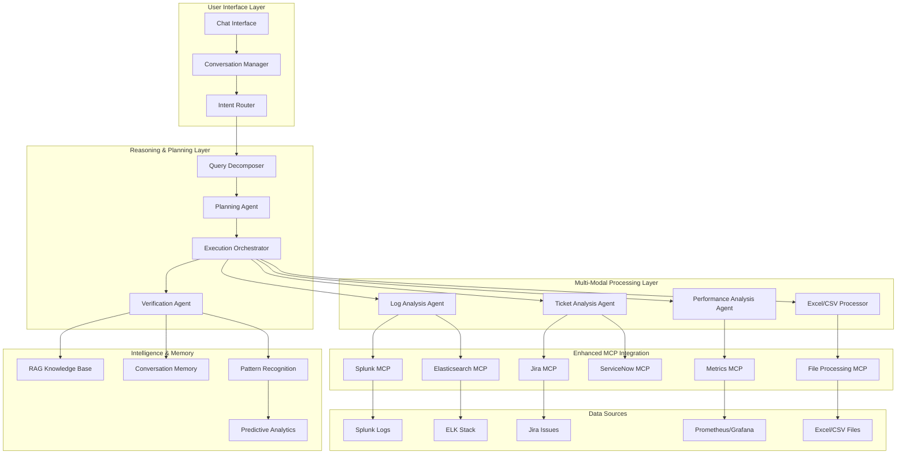

# Advanced Agentic System Architecture for Multi-Modal Analysis

## 🎯 Executive Summary

Building on your existing **Enhanced Correlation Client**, this document outlines the architecture for a **Claude Desktop-like agentic system** that can perform intelligent analysis across:

- **Log Analysis**: Splunk, Elasticsearch, CloudWatch, etc.
- **Ticket Management**: Jira, ServiceNow, GitHub Issues
- **Performance Analytics**: Excel files, CSV data, 90th percentiles, SLA metrics
- **Reasoning & Decision Making**: Multi-step analysis, root cause identification, trend prediction

**Key Differentiators from Current System:**

- **Conversational Memory**: Maintains context across multi-turn conversations
- **Planning & Execution**: Breaks down complex queries into executable steps
- **Multi-Modal Processing**: Handles Excel files, charts, logs, and structured data
- **Human-in-the-Loop**: Asks clarifying questions and confirms actions
- **Autonomous Reasoning**: Makes decisions based on evidence and patterns

---

## 🏗️ System Architecture

### Current State Analysis (What You Have)

Your existing `enhanced_correlation_client.py` provides:

```python
✅ LLM Integration (OpenAI GPT-4)
✅ MCP Protocol Support (Splunk HTTP/SSE, Jira Docker stdio)
✅ Semantic Correlation Engine
✅ Function Calling Architecture
✅ Basic Query Processing
✅ Confidence Scoring System
```

### What's Missing for Full Agentic Capabilities

```python
❌ Conversational State Management
❌ Multi-Step Planning & Execution
❌ Excel/CSV Processing Capabilities
❌ Performance Analytics Tools
❌ RAG Knowledge Base
❌ Human-in-the-Loop Workflow
❌ Multi-Modal Data Processing
❌ Persistent Memory System
```

### Enhanced Agentic Architecture



---

#### 1. **Extend Current Enhanced Correlation Client**

```python
# Build on your existing client
class AgenticEnhancedCorrelationClient(EnhancedCorrelationClient):
    """Enhanced version with full agentic capabilities"""

    def __init__(self):
        super().__init__()

        # Add new agentic components
        self.conversation_manager = ConversationManager()
        self.planning_agent = PlanningAgent(self.openai_client)
        self.performance_agent = PerformanceAnalysisAgent()
        self.rag_engine = EnhancedRAGEngine()

        # Enhanced MCP connections
        self.excel_processor = ExcelProcessorMCP()
        self.elasticsearch_client = ElasticsearchMCP()
        self.metrics_client = MetricsMCP()
```

#### 2. **Add Multi-Modal MCP Servers**

```python
# New MCP Server for Excel/CSV Processing
class ExcelProcessorMCP:
    """MCP server for Excel and CSV file analysis"""

    tools = [
        {
            "name": "analyze_excel_percentiles",
            "description": "Calculate 90th, 95th, 99th percentiles from Excel/CSV data",
            "parameters": {
                "file_path": {"type": "string", "description": "Path to Excel/CSV file"},
                "metric_column": {"type": "string", "description": "Column name for metric analysis"},
                "time_column": {"type": "string", "description": "Time column for temporal analysis"},
                "percentiles": {"type": "array", "items": {"type": "number"}, "default": [50, 90, 95, 99]}
            }
        },
        {
            "name": "analyze_performance_trends",
            "description": "Analyze performance trends and predict future values",
            "parameters": {
                "file_path": {"type": "string"},
                "forecast_days": {"type": "integer", "default": 7}
            }
        },
        {
            "name": "correlate_metrics",
            "description": "Find correlations between different performance metrics",
            "parameters": {
                "file_path": {"type": "string"},
                "metric_columns": {"type": "array", "items": {"type": "string"}}
            }
        }
    ]

# Enhanced Elasticsearch MCP Server
class ElasticsearchMCP:
    """Enhanced Elasticsearch integration with ML capabilities"""

    tools = [
        {
            "name": "search_logs_with_ml",
            "description": "Search logs with ML-based anomaly detection",
            "parameters": {
                "query": {"type": "string"},
                "indices": {"type": "array", "items": {"type": "string"}},
                "time_range": {"type": "string"},
                "enable_anomaly_detection": {"type": "boolean", "default": True},
                "enable_clustering": {"type": "boolean", "default": True}
            }
        },
        {
            "name": "analyze_log_patterns",
            "description": "Analyze patterns in log data over time",
            "parameters": {
                "query": {"type": "string"},
                "pattern_type": {"type": "string", "enum": ["temporal", "frequency", "error_clustering"]}
            }
        }
    ]

# Metrics MCP Server (Prometheus/Grafana)
class MetricsMCP:
    """MCP server for performance metrics analysis"""

    tools = [
        {
            "name": "query_performance_metrics",
            "description": "Query performance metrics with statistical analysis",
            "parameters": {
                "metric_name": {"type": "string"},
                "time_range": {"type": "string"},
                "aggregation": {"type": "string", "enum": ["avg", "max", "min", "percentile"]},
                "percentile": {"type": "number", "default": 90}
            }
        },
        {
            "name": "compare_sla_performance",
            "description": "Compare actual performance against SLA thresholds",
            "parameters": {
                "service": {"type": "string"},
                "sla_threshold": {"type": "number"},
                "time_range": {"type": "string"}
            }
        }
    ]
```

#### 3. **Enhanced Function Definitions for Agentic Capabilities**

```python
def get_agentic_function_definitions(self) -> List[Dict[str, Any]]:
    """Extended function definitions for full agentic system"""

    return [
        # Existing functions from your current system
        *self.get_correlation_function_definitions(),

        # New agentic functions
        {
            "name": "analyze_performance_percentiles",
            "description": "Analyze performance metrics with percentile calculations (90th, 95th, 99th)",
            "parameters": {
                "type": "object",
                "properties": {
                    "data_source": {
                        "type": "string",
                        "enum": ["excel_file", "prometheus", "csv_file", "splunk_metrics"],
                        "description": "Source of performance data"
                    },
                    "file_path": {
                        "type": "string",
                        "description": "Path to Excel/CSV file (if using file source)"
                    },
                    "metric_name": {
                        "type": "string",
                        "description": "Name of the metric to analyze (e.g., response_time, cpu_usage)"
                    },
                    "time_range": {
                        "type": "string",
                        "description": "Time range for analysis (e.g., '7d', '24h', '1w')"
                    },
                    "percentiles": {
                        "type": "array",
                        "items": {"type": "number"},
                        "default": [50, 90, 95, 99],
                        "description": "Percentiles to calculate"
                    }
                },
                "required": ["data_source", "metric_name"]
            }
        },
        {
            "name": "create_execution_plan",
            "description": "Create multi-step execution plan for complex analysis requests",
            "parameters": {
                "type": "object",
                "properties": {
                    "user_query": {
                        "type": "string",
                        "description": "Original user query requiring multi-step analysis"
                    },
                    "available_data_sources": {
                        "type": "array",
                        "items": {"type": "string"},
                        "description": "Available data sources (splunk, jira, excel, prometheus, etc.)"
                    },
                    "user_context": {
                        "type": "object",
                        "description": "Additional context from conversation history"
                    }
                },
                "required": ["user_query"]
            }
        },
        {
            "name": "cross_system_correlation",
            "description": "Correlate data across multiple systems (logs + tickets + metrics)",
            "parameters": {
                "type": "object",
                "properties": {
                    "primary_system": {
                        "type": "string",
                        "enum": ["splunk", "jira", "elasticsearch", "prometheus"],
                        "description": "Primary system to start correlation from"
                    },
                    "correlation_systems": {
                        "type": "array",
                        "items": {"type": "string"},
                        "description": "Additional systems to correlate with"
                    },
                    "time_window": {
                        "type": "string",
                        "description": "Time window for correlation analysis"
                    },
                    "correlation_threshold": {
                        "type": "number",
                        "default": 0.7,
                        "description": "Minimum correlation confidence score"
                    }
                },
                "required": ["primary_system", "correlation_systems"]
            }
        },
        {
            "name": "ask_clarifying_question",
            "description": "Ask user for clarification when query is ambiguous",
            "parameters": {
                "type": "object",
                "properties": {
                    "question": {
                        "type": "string",
                        "description": "Clarifying question to ask the user"
                    },
                    "options": {
                        "type": "array",
                        "items": {"type": "string"},
                        "description": "Specific options for user to choose from (optional)"
                    },
                    "reason": {
                        "type": "string",
                        "description": "Explanation of why clarification is needed"
                    }
                },
                "required": ["question", "reason"]
            }
        },
        {
            "name": "generate_predictive_insights",
            "description": "Generate predictions about future issues based on current data",
            "parameters": {
                "type": "object",
                "properties": {
                    "analysis_data": {
                        "type": "object",
                        "description": "Current analysis results to base predictions on"
                    },
                    "prediction_horizon": {
                        "type": "string",
                        "default": "7d",
                        "description": "How far into future to predict (e.g., '7d', '30d')"
                    },
                    "confidence_threshold": {
                        "type": "number",
                        "default": 0.8,
                        "description": "Minimum confidence for predictions"
                    }
                },
                "required": ["analysis_data"]
            }
        }
    ]
```

### Phase 2: Advanced Data Processing (6-8 weeks)

#### 1. **Excel/CSV Processing Engine**

```python
class AdvancedExcelProcessor:
    """Advanced Excel/CSV processing with statistical analysis"""

    def __init__(self):
        self.supported_formats = ['.xlsx', '.xls', '.csv', '.json']
        self.ml_models = {
            'anomaly_detection': IsolationForest(),
            'trend_prediction': LinearRegression(),
            'clustering': KMeans()
        }

    async def analyze_performance_data(self, file_path: str, analysis_config: Dict) -> PerformanceAnalysis:
        """
        Comprehensive performance analysis of Excel/CSV data

        Capabilities:
        - Automatic column detection (time, metrics, categories)
        - Statistical analysis (mean, median, percentiles, std dev)
        - Trend analysis and forecasting
        - Anomaly detection using ML
        - SLA compliance checking
        - Interactive visualization generation
        """

        import pandas as pd
        import numpy as np
        from scipy import stats
        import matplotlib.pyplot as plt
        import seaborn as sns

        # Load data with intelligent parsing
        df = await self._load_data_intelligently(file_path)

        # Auto-detect column types
        column_analysis = await self._analyze_columns(df)
        time_cols = column_analysis['time_columns']
        metric_cols = column_analysis['metric_columns']
        category_cols = column_analysis['category_columns']

        # Perform requested analysis
        results = {}

        if 'percentiles' in analysis_config:
            results['percentiles'] = await self._calculate_percentiles(
                df, metric_cols, analysis_config['percentiles']
            )

        if 'trends' in analysis_config:
            results['trends'] = await self._analyze_trends(
                df, time_cols, metric_cols
            )

        if 'anomalies' in analysis_config:
            results['anomalies'] = await self._detect_anomalies(
                df, metric_cols
            )

        if 'sla_compliance' in analysis_config:
            results['sla_compliance'] = await self._check_sla_compliance(
                df, analysis_config['sla_thresholds']
            )

        # Generate insights and recommendations
        results['insights'] = await self._generate_insights(df, results)
        results['recommendations'] = await self._generate_recommendations(results)

        # Create visualizations
        if analysis_config.get('generate_charts', True):
            results['visualizations'] = await self._create_visualizations(df, results)

        return PerformanceAnalysis(**results)

    async def _calculate_percentiles(self, df: pd.DataFrame, metric_cols: List[str], percentiles: List[int]) -> Dict:
        """Calculate percentiles with temporal analysis"""

        results = {}

        for col in metric_cols:
            if col in df.columns:
                # Overall percentiles
                percentile_values = np.percentile(df[col].dropna(), percentiles)
                results[col] = dict(zip(percentiles, percentile_values))

                # Temporal percentiles (if time column available)
                if 'timestamp' in df.columns:
                    df['hour'] = pd.to_datetime(df['timestamp']).dt.hour
                    hourly_percentiles = df.groupby('hour')[col].quantile([p/100 for p in percentiles])
                    results[f'{col}_hourly'] = hourly_percentiles.unstack().to_dict()

        return results

    async def _detect_anomalies(self, df: pd.DataFrame, metric_cols: List[str]) -> Dict:
        """ML-based anomaly detection"""

        anomalies = {}

        for col in metric_cols:
            if col in df.columns and df[col].notna().sum() > 10:  # Minimum data points
                # Use Isolation Forest for anomaly detection
                data = df[col].dropna().values.reshape(-1, 1)

                isolation_forest = IsolationForest(contamination=0.05, random_state=42)
                anomaly_labels = isolation_forest.fit_predict(data)

                # Get anomaly indices and values
                anomaly_indices = np.where(anomaly_labels == -1)[0]
                anomaly_values = data[anomaly_indices].flatten()

                anomalies[col] = {
                    'count': len(anomaly_indices),
                    'indices': anomaly_indices.tolist(),
                    'values': anomaly_values.tolist(),
                    'percentage': (len(anomaly_indices) / len(data)) * 100
                }

        return anomalies
```

#### 2. **Enhanced Reasoning and Planning System**

```python
class AgenticReasoningEngine:
    """Advanced reasoning engine for multi-step analysis and decision making"""

    def __init__(self, llm_client):
        self.llm = llm_client
        self.reasoning_strategies = {
            'root_cause_analysis': self._root_cause_reasoning,
            'predictive_analysis': self._predictive_reasoning,
            'correlation_analysis': self._correlation_reasoning,
            'performance_optimization': self._optimization_reasoning
        }

    async def reason_about_findings(self, findings: Dict, reasoning_type: str) -> ReasoningResult:
        """
        Apply structured reasoning to analysis findings

        Reasoning Types:
        - root_cause_analysis: Why did this issue occur?
        - predictive_analysis: What will happen next?
        - correlation_analysis: How are these events related?
        - performance_optimization: How can we improve this?
        """

        if reasoning_type not in self.reasoning_strategies:
            raise ValueError(f"Unknown reasoning type: {reasoning_type}")

        return await self.reasoning_strategies[reasoning_type](findings)

    async def _root_cause_reasoning(self, findings: Dict) -> ReasoningResult:
        """Multi-step root cause analysis using LLM reasoning"""

        reasoning_prompt = f"""
        You are an expert system administrator analyzing the following findings to determine root causes.

        FINDINGS:
        {json.dumps(findings, indent=2)}

        Apply structured root cause analysis:

        1. TEMPORAL ANALYSIS:
           - When did issues start?
           - What was the progression timeline?
           - Are there any temporal correlations?

        2. SYSTEM DEPENDENCY ANALYSIS:
           - Which systems are involved?
           - What are the dependencies between them?
           - Where could single points of failure exist?

        3. PATTERN RECOGNITION:
           - Are there similar historical incidents?
           - What patterns emerge from the data?
           - Are there any cyclical behaviors?

        4. HYPOTHESIS GENERATION:
           - What are the most likely root causes?
           - Rank hypotheses by probability and evidence
           - What additional data would confirm/refute hypotheses?

        5. RECOMMENDATION SYNTHESIS:
           - Immediate actions to take
           - Preventive measures
           - Long-term improvements

        Provide structured reasoning with confidence scores for each hypothesis.
        """

        response = await self.llm.generate_response(reasoning_prompt)

        return ReasoningResult(
            reasoning_type="root_cause_analysis",
            analysis=response,
            confidence_score=self._extract_confidence(response),
            hypotheses=self._extract_hypotheses(response),
            recommendations=self._extract_recommendations(response)
        )

    async def _predictive_reasoning(self, findings: Dict) -> ReasoningResult:
        """Predictive analysis using trend data and patterns"""

        reasoning_prompt = f"""
        Analyze these findings to make predictions about future system behavior:

        CURRENT STATE:
        {json.dumps(findings, indent=2)}

        Apply predictive reasoning:

        1. TREND EXTRAPOLATION:
           - What trends are visible in the data?
           - How might these trends continue?
           - What are potential inflection points?

        2. CAPACITY ANALYSIS:
           - What are current resource utilization levels?
           - When might capacity limits be reached?
           - What are the growth patterns?

        3. RISK ASSESSMENT:
           - What failure modes are becoming more likely?
           - What early warning signs should we monitor?
           - What preventive actions are recommended?

        4. SCENARIO PLANNING:
           - Best case: What if trends improve?
           - Expected case: What if trends continue?
           - Worst case: What if issues compound?

        Provide specific predictions with timelines and confidence intervals.
        """

        response = await self.llm.generate_response(reasoning_prompt)

        return ReasoningResult(
            reasoning_type="predictive_analysis",
            analysis=response,
            predictions=self._extract_predictions(response),
            risk_factors=self._extract_risk_factors(response),
            monitoring_recommendations=self._extract_monitoring_recommendations(response)
        )
```

### Phase 3: Human-in-the-Loop Integration (4-6 weeks)

#### 1. **Interactive Conversation Flow**

```python
class InteractiveConversationFlow:
    """Manages human-in-the-loop interactions for complex analysis"""

    async def handle_complex_query(self, user_query: str, context: Dict) -> ConversationFlow:
        """
        Handle complex queries requiring human interaction and confirmation

        Example Flow:
        User: "Analyze auth service performance issues and create tickets if needed"

        System Flow:
        1. Creates analysis plan → Shows to user for confirmation
        2. Executes analysis → Presents findings
        3. Asks clarifying questions → "Which service team should handle this?"
        4. Proposes ticket creation → Shows draft ticket for approval
        5. Executes approved actions → Confirms completion
        """

        # Step 1: Create execution plan
        plan = await self.planning_agent.create_plan(user_query, context)

        # Step 2: Ask for plan confirmation
        plan_approval = await self.ask_user_confirmation(
            f"I'll analyze this by: {plan.summary}\n\nProceed with this plan?",
            plan.details
        )

        if not plan_approval:
            return ConversationFlow(status="cancelled", message="Analysis cancelled by user")

        # Step 3: Execute plan with checkpoints
        results = {}
        for step in plan.steps:
            if step.requires_confirmation:
                # Ask for confirmation before potentially destructive actions
                confirmation = await self.ask_user_confirmation(
                    step.confirmation_message,
                    step.details
                )
                if not confirmation:
                    continue

            # Execute step
            step_result = await self.execute_step(step)
            results[step.name] = step_result

            # Check if clarification needed
            if step_result.requires_clarification:
                clarification = await self.ask_clarification(step_result.clarification_question)
                results[step.name].clarification = clarification

        # Step 4: Synthesize results and ask for next actions
        synthesis = await self.synthesize_results(results)
        next_actions = await self.suggest_next_actions(synthesis)

        if next_actions:
            action_approval = await self.ask_user_choice(
                "Based on the analysis, I recommend these actions:",
                next_actions
            )

            if action_approval:
                await self.execute_approved_actions(action_approval)

        return ConversationFlow(
            status="completed",
            results=synthesis,
            actions_taken=action_approval or [],
            conversation_history=self.conversation_manager.get_history()
        )

    async def ask_user_confirmation(self, message: str, details: Dict = None) -> bool:
        """Ask user for yes/no confirmation with optional details"""

        confirmation_request = {
            "type": "confirmation",
            "message": message,
            "details": details,
            "options": ["Yes", "No"],
            "timestamp": datetime.now().isoformat()
        }

        # In real implementation, this would be sent to UI and wait for response
        # For now, simulate user interaction
        print(f"\n🤔 **CONFIRMATION NEEDED**")
        print(f"   {message}")
        if details:
            print(f"   Details: {json.dumps(details, indent=2)}")

        # Placeholder for actual user interaction
        return True  # In real system, wait for user input

    async def ask_clarification(self, question: str, options: List[str] = None) -> str:
        """Ask user for clarification with optional multiple choice"""

        clarification_request = {
            "type": "clarification",
            "question": question,
            "options": options,
            "timestamp": datetime.now().isoformat()
        }

        print(f"\n❓ **CLARIFICATION NEEDED**")
        print(f"   {question}")
        if options:
            for i, option in enumerate(options, 1):
                print(f"   {i}. {option}")

        # Placeholder for actual user interaction
        return options[0] if options else "Default response"
```

#### 2. **Intelligent Action Suggestions**

```python
class ActionSuggestionEngine:
    """Generates intelligent action suggestions based on analysis results"""

    async def suggest_actions(self, analysis_results: Dict) -> List[ActionSuggestion]:
        """
        Generate contextual action suggestions based on analysis findings

        Action Types:
        - create_jira_ticket: Create new tickets for identified issues
        - update_monitoring: Add new monitoring/alerts
        - schedule_maintenance: Propose maintenance windows
        - escalate_issue: Escalate critical issues to appropriate teams
        - document_findings: Create documentation for future reference
        - optimize_performance: Suggest performance improvements
        """

        suggestions = []

        # Analyze findings for action opportunities
        if self._has_critical_errors(analysis_results):
            suggestions.append(await self._suggest_ticket_creation(analysis_results))

        if self._has_performance_issues(analysis_results):
            suggestions.append(await self._suggest_optimization(analysis_results))

        if self._has_recurring_patterns(analysis_results):
            suggestions.append(await self._suggest_monitoring_improvements(analysis_results))

        if self._has_capacity_concerns(analysis_results):
            suggestions.append(await self._suggest_capacity_planning(analysis_results))

        return suggestions

    async def _suggest_ticket_creation(self, analysis_results: Dict) -> ActionSuggestion:
        """Suggest creating Jira tickets for identified issues"""

        ticket_suggestion_prompt = f"""
        Based on this analysis, create a Jira ticket suggestion:

        ANALYSIS RESULTS:
        {json.dumps(analysis_results, indent=2)}

        Generate a ticket with:
        - Appropriate priority based on business impact
        - Clear title and description
        - Relevant labels and components
        - Suggested assignee/team
        - Steps to reproduce (if applicable)
        - Acceptance criteria for resolution

        Format as JSON with ticket fields.
        """

        ticket_suggestion = await self.llm.generate_response(ticket_suggestion_prompt)

        return ActionSuggestion(
            type="create_jira_ticket",
            priority="high" if analysis_results.get('critical_issues') else "medium",
            title="Create Jira ticket for identified issue",
            description="A new issue has been identified that requires tracking and resolution",
            action_data=json.loads(ticket_suggestion),
            requires_approval=True,
            estimated_effort="15 minutes"
        )
```

---

## 🚀 Technology Stack & Implementation

### Core Technologies

```yaml
Foundation (Building on your existing system):
  Base: enhanced_correlation_client.py
  LLM: OpenAI GPT-4o (your current model)
  MCP: Model Context Protocol (your current architecture)

Agentic Extensions:
  Framework: LangChain + LangGraph (for agentic workflows)
  Memory: ChromaDB (vector storage) + Redis (session state)
  Planning: LangGraph StateGraph for multi-step workflows

Data Processing:
  Excel/CSV: pandas + numpy + scipy (statistical analysis)
  Performance: prometheus_client + grafana_api
  ML: scikit-learn (anomaly detection, clustering)
  Visualization: matplotlib + seaborn + plotly

Enhanced MCP Servers:
  Excel Processor: FastMCP + pandas for file analysis
  Elasticsearch: Enhanced elasticsearch-py integration
  Metrics: prometheus_api_client + custom MCP wrapper

Conversational AI:
  State Management: Redis + custom conversation models
  Human-in-Loop: FastAPI websockets for real-time interaction
  Reasoning: Custom reasoning engine with structured prompts
```

### Deployment Architecture

```yaml
Container Architecture:
  agentic-orchestrator:
    - Main conversation manager
    - LLM reasoning engine
    - Planning and execution logic

  mcp-servers:
    - excel-processor-mcp: File analysis server
    - elasticsearch-enhanced-mcp: Advanced log analysis
    - metrics-analysis-mcp: Performance metrics server
    - knowledge-base-mcp: RAG and memory management

  data-storage:
    - redis: Session state and conversation memory
    - chromadb: Vector embeddings and knowledge base
    - postgresql: Structured data and audit logs

  web-interface:
    - React/FastAPI: Chat interface
    - WebSocket: Real-time communication
    - File upload: Excel/CSV processing interface
```

---

## 🎯 Implementation Roadmap

### Phase 1: Foundation (4-6 weeks)

- [ ] Extend enhanced_correlation_client.py with agentic base classes
- [ ] Implement conversation state management
- [ ] Add basic planning and execution framework
- [ ] Create Excel/CSV processing MCP server
- [ ] Build human-in-the-loop confirmation system

### Phase 2: Intelligence (6-8 weeks)

- [ ] Implement advanced reasoning engine
- [ ] Add predictive analytics capabilities
- [ ] Build enhanced RAG knowledge base
- [ ] Create action suggestion system
- [ ] Integrate ML-based anomaly detection

### Phase 3: Polish & Production (4-6 weeks)

- [ ] Create intuitive chat interface
- [ ] Add comprehensive error handling
- [ ] Implement performance monitoring
- [ ] Build deployment automation
- [ ] Create comprehensive documentation

### Key Success Metrics

- **Query Understanding**: 95%+ intent recognition accuracy
- **Multi-Step Planning**: Successfully execute 90%+ of complex multi-step queries
- **Performance Analysis**: Process Excel files and calculate percentiles in <30 seconds
- **User Satisfaction**: 4.5/5+ rating on conversation quality and usefulness
- **Response Time**: 90th percentile response time <45 seconds for complex queries

---

## 💡 Next Steps

To start building this agentic system:

1. **Immediate**: Extend your current enhanced_correlation_client.py with conversation state management
2. **Week 1**: Implement Excel/CSV processing MCP server for performance analysis
3. **Week 2**: Add basic planning agent and human-in-the-loop confirmations
4. **Week 3**: Create enhanced reasoning engine for multi-step analysis
5. **Week 4**: Build RAG knowledge base for case-based reasoning

**Would you like me to:**

1. 🧩 Create a detailed LangGraph implementation skeleton for the agentic workflow?
2. 🛠️ Build the Excel/CSV processing MCP server as a starting point?
3. 📊 Design the conversation state management system?
4. 🏗️ Create a complete deployment guide with Docker configurations?

This architecture builds directly on your existing system while adding the sophisticated reasoning, planning, and multi-modal capabilities needed for a Claude Desktop-like experience with deep analytical capabilities across logs, tickets, and performance data.

---

## 🧠 Agentic Reasoning Framework

### Core Agentic Components

#### 1. **Conversation Manager**

```python
class ConversationManager:
    """Maintains conversational state and context across multi-turn interactions"""

    def __init__(self):
        self.conversation_history = []
        self.user_preferences = {}
        self.active_context = {}
        self.pending_actions = []

    async def process_user_input(self, user_input: str) -> AgenticResponse:
        """
        Process user input with full conversational context

        Capabilities:
        - References to previous queries ("show me the same data for last week")
        - Contextual follow-ups ("what about the performance impact?")
        - Clarification requests ("which service did you mean?")
        - Action confirmations ("shall I create a ticket for this issue?")
        """

        # Update conversation context
        self.conversation_history.append({
            "timestamp": datetime.now(),
            "user_input": user_input,
            "context": self.active_context.copy()
        })

        # Route to appropriate agent
        return await self.intent_router.route_query(user_input, self.active_context)
```

#### 2. **Planning Agent**

```python
class PlanningAgent:
    """Breaks down complex queries into executable steps with reasoning"""

    async def create_execution_plan(self, user_query: str, context: Dict) -> ExecutionPlan:
        """
        Create multi-step execution plan for complex analysis

        Example Query: "Find performance issues in auth service last week,
                       correlate with tickets, and analyze 90th percentile response times"

        Generated Plan:
        1. Extract time range (last week) and service (auth service)
        2. Search Splunk for auth service errors in time range
        3. Search Jira for related tickets in same period
        4. Query performance metrics for 90th percentile analysis
        5. Correlate findings across all data sources
        6. Generate comprehensive report with recommendations
        7. Ask user if they want to create follow-up tickets
        """

        planning_prompt = f"""
        Analyze this user query and create a step-by-step execution plan:
        Query: {user_query}
        Context: {context}

        Consider:
        - Data sources needed (logs, tickets, metrics, files)
        - Sequence dependencies (some steps require others)
        - User confirmation points (destructive actions)
        - Performance considerations (parallel vs sequential)

        Generate a JSON execution plan with reasoning for each step.
        """

        plan = await self.llm.generate_plan(planning_prompt)
        return ExecutionPlan.from_dict(plan)
```

#### 3. **Multi-Modal Processing Agents**

##### Performance Analysis Agent

```python
class PerformanceAnalysisAgent:
    """Specialized agent for performance metrics and Excel/CSV analysis"""

    async def analyze_percentiles(self, data_source: str, metric: str, time_range: str) -> PerformanceReport:
        """
        Analyze performance percentiles (50th, 90th, 95th, 99th)

        Capabilities:
        - Excel file processing (XLSX, CSV)
        - Statistical analysis (percentiles, trends, anomalies)
        - Performance threshold detection
        - SLA compliance checking
        - Capacity planning recommendations
        """

        # Multi-source data collection
        data = await self._collect_performance_data(data_source, metric, time_range)

        # Statistical analysis
        percentiles = self._calculate_percentiles(data, [50, 90, 95, 99])
        trends = self._analyze_trends(data)
        anomalies = self._detect_anomalies(data)

        # SLA analysis
        sla_compliance = self._check_sla_compliance(percentiles, self.sla_thresholds)

        return PerformanceReport(
            percentiles=percentiles,
            trends=trends,
            anomalies=anomalies,
            sla_compliance=sla_compliance,
            recommendations=self._generate_recommendations(percentiles, trends)
        )

    async def process_excel_file(self, file_path: str, analysis_type: str) -> ExcelAnalysisResult:
        """
        Process Excel/CSV files for performance analysis

        Supported Operations:
        - Percentile calculations across time series
        - Trend analysis and forecasting
        - Correlation analysis between metrics
        - Outlier detection and root cause hints
        - Automated chart generation
        """

        import pandas as pd
        import numpy as np
        from scipy import stats

        # Load and validate data
        df = pd.read_excel(file_path) if file_path.endswith('.xlsx') else pd.read_csv(file_path)

        # Intelligent column detection
        time_columns = self._detect_time_columns(df)
        metric_columns = self._detect_metric_columns(df)

        # Perform analysis based on type
        if analysis_type == "percentile_analysis":
            return await self._perform_percentile_analysis(df, metric_columns)
        elif analysis_type == "trend_analysis":
            return await self._perform_trend_analysis(df, time_columns, metric_columns)
        elif analysis_type == "correlation_analysis":
            return await self._perform_correlation_analysis(df, metric_columns)
```

##### Enhanced Log Analysis Agent

```python
class EnhancedLogAnalysisAgent:
    """Extended log analysis with pattern recognition and anomaly detection"""

    async def analyze_log_patterns(self, query: Dict) -> LogAnalysisResult:
        """
        Advanced log pattern analysis with ML-based insights

        New Capabilities:
        - Anomaly detection in log volumes and patterns
        - Error clustering and categorization
        - Temporal pattern analysis (hourly/daily trends)
        - Cross-service correlation analysis
        - Predictive failure detection
        """

        # Multi-source log collection
        log_sources = ['splunk', 'elasticsearch', 'cloudwatch']
        log_data = await self._collect_logs_parallel(log_sources, query)

        # ML-based pattern analysis
        patterns = await self._detect_error_patterns(log_data)
        anomalies = await self._detect_temporal_anomalies(log_data)
        clusters = await self._cluster_similar_errors(log_data)

        # Cross-reference with known issues
        similar_cases = await self.rag_engine.find_similar_cases(patterns)

        return LogAnalysisResult(
            patterns=patterns,
            anomalies=anomalies,
            clusters=clusters,
            similar_cases=similar_cases,
            predictions=await self._predict_future_issues(patterns)
        )
```

#### 4. **RAG Knowledge Base with Long-Term Memory**

```python
class EnhancedRAGEngine:
    """Advanced RAG with multi-modal embeddings and case-based reasoning"""

    def __init__(self):
        self.vector_store = ChromaDB(collection_name="agentic_knowledge")
        self.embedding_models = {
            'text': SentenceTransformer('all-mpnet-base-v2'),
            'code': SentenceTransformer('microsoft/codebert-base'),
            'logs': SentenceTransformer('sentence-transformers/all-MiniLM-L6-v2'),
            'metrics': SentenceTransformer('all-mpnet-base-v2')
        }

    async def store_conversation_case(self, conversation: Dict, resolution: Dict) -> str:
        """
        Store complete conversation context for future reference

        Stored Information:
        - Original user query and intent
        - Execution plan and steps taken
        - Data sources accessed and queries used
        - Analysis results and insights discovered
        - Final resolution and user satisfaction
        - Performance metrics and timing
        """

        case_embedding = await self._create_multi_modal_embedding(conversation, resolution)

        case_metadata = {
            "conversation_id": conversation["id"],
            "timestamp": datetime.now().isoformat(),
            "user_query": conversation["original_query"],
            "data_sources": conversation["data_sources_used"],
            "resolution_type": resolution["type"],
            "success_score": resolution["user_satisfaction"],
            "execution_time": conversation["total_execution_time"],
            "tags": self._extract_semantic_tags(conversation, resolution)
        }

        return await self.vector_store.add_document(
            embedding=case_embedding,
            content=json.dumps({"conversation": conversation, "resolution": resolution}),
            metadata=case_metadata
        )

    async def retrieve_relevant_cases(self, current_query: str, k: int = 5) -> List[RelevantCase]:
        """
        Retrieve similar cases with reasoning about relevance

        Enhanced Retrieval:
        - Semantic similarity of user intent
        - Data source compatibility (same systems available)
        - Temporal relevance (recent cases weighted higher)
        - Success score filtering (only successful resolutions)
        - Context similarity (similar system states)
        """

        query_embedding = await self._embed_query(current_query)

        similar_cases = await self.vector_store.similarity_search(
            query_vector=query_embedding,
            k=k * 2,  # Get more candidates for filtering
            filter={
                "success_score": {"$gte": 0.7},  # Only successful cases
                "timestamp": {"$gte": (datetime.now() - timedelta(days=90)).isoformat()}  # Recent cases
            }
        )

        # Re-rank by contextual relevance
        ranked_cases = await self._rank_cases_by_context(similar_cases, current_query)

        return ranked_cases[:k]
```

---
