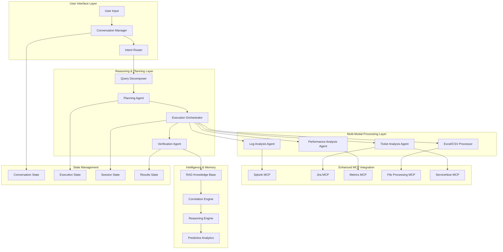

# IEMS Architectural Execution Guide: The Complete Reference

## 📋 Executive Summary

This document serves as the **definitive architectural execution guide** for the Intelligent Error Diagnosis and Monitoring System (IEMS). It demonstrates how the system processes complex, multi-faceted queries through detailed component interactions, state management, and data flow patterns.

**Reference Query**: _"Give me the top 5 performance issues in Supplier Management (SM) that affected multiple customers in the last 4 months. I am interested in the performance related issues only. Categorize them by issue types. Give me Issue summary, how long each customer has faced the issue? How was the issue fixed and what is the current status of these issues?"_

---

## 🏗️ Complete System Architecture Overview



---

## 🎯 Query Processing Execution Flow

### Phase 1: Query Reception and Initial Processing

#### Component: **Conversation Manager**

**Purpose**: Maintains conversational context and manages session state across multi-turn interactions.

**Input**:

```json
{
  "user_input": "Give me the top 5 performance issues in Supplier Management (SM) that affected multiple customers in the last 4 months. I am interested in the performance related issues only. Categorize them by issue types. Give me Issue summary, how long each customer has faced the issue? How was the issue fixed and what is the current status of these issues?",
  "session_id": "session_2025_11_03_001",
  "timestamp": "2025-11-03T10:15:30Z",
  "user_context": {
    "user_id": "analyst_001",
    "role": "performance_analyst",
    "previous_queries": ["SM system status", "customer impact analysis"]
  }
}
```

**Processing**:

```python
class ConversationManager:
    def process_user_input(self, input_data: Dict) -> ConversationContext:
        # Extract conversation metadata
        context = ConversationContext(
            session_id=input_data["session_id"],
            user_query=input_data["user_input"],
            conversation_history=self._load_conversation_history(input_data["session_id"]),
            user_preferences=self._get_user_preferences(input_data["user_context"]["user_id"]),
            domain_context="supplier_management"
        )

        # Identify query complexity and scope
        context.complexity_markers = self._analyze_complexity(input_data["user_input"])
        context.expected_data_sources = ["logs", "tickets", "metrics", "performance_data"]

        return context
```

**Output**:

```json
{
  "conversation_context": {
    "session_id": "session_2025_11_03_001",
    "query_id": "query_001",
    "complexity_level": "HIGH_COMPLEX",
    "complexity_markers": [
      "multi_temporal_analysis",
      "customer_impact_analysis",
      "performance_categorization",
      "root_cause_investigation",
      "status_tracking"
    ],
    "domain_context": "supplier_management",
    "expected_processing_time": "120-180 seconds",
    "conversation_history": [
      { "query": "SM system status", "timestamp": "2025-11-03T09:30:00Z" },
      {
        "query": "customer impact analysis",
        "timestamp": "2025-11-03T09:45:00Z"
      }
    ]
  }
}
```

**State Management**:

- **Conversation State**: Persistent session tracking across multiple queries
- **Context State**: Domain-specific knowledge from previous interactions
- **User State**: Preferences, role-based access, and personalization settings

---

### Phase 2: Intent Analysis and Routing

#### Component: **Intent Router**

**Purpose**: Analyzes user intent and determines the optimal processing strategy for complex multi-system queries.

**Input**: Conversation context from Conversation Manager

**Processing**:

```python
class IntentRouter:
    def analyze_and_route(self, context: ConversationContext) -> RoutingDecision:
        # Multi-dimensional intent analysis
        intent_analysis = {
            "primary_intent": self._classify_primary_intent(context.user_query),
            "secondary_intents": self._extract_secondary_intents(context.user_query),
            "data_requirements": self._analyze_data_requirements(context.user_query),
            "processing_strategy": self._determine_strategy(context.complexity_level)
        }

        return RoutingDecision(**intent_analysis)
```

**Output**:

```json
{
  "routing_decision": {
    "intent_classification": {
      "primary_intent": "PERFORMANCE_ANALYSIS_WITH_CUSTOMER_IMPACT",
      "confidence": 0.96,
      "secondary_intents": [
        "MULTI_CUSTOMER_CORRELATION",
        "ISSUE_CATEGORIZATION",
        "STATUS_TRACKING",
        "ROOT_CAUSE_ANALYSIS"
      ]
    },
    "complexity_assessment": {
      "level": "VERY_COMPLEX",
      "reasoning": "Multi-temporal analysis across 4 months with customer impact correlation and categorization requirements",
      "estimated_steps": 8,
      "parallel_operations": 4
    },
    "processing_strategy": {
      "strategy": "MULTI_PHASE_DECOMPOSITION",
      "routing_decision": "ROUTE_TO_QUERY_DECOMPOSER",
      "execution_pattern": "PARALLEL_WITH_DEPENDENCIES",
      "human_confirmation": false
    },
    "resource_requirements": {
      "required_agents": [
        "PerformanceAnalysisAgent",
        "TicketAnalysisAgent",
        "LogAnalysisAgent",
        "CorrelationEngine"
      ],
      "data_sources": ["splunk", "jira", "servicenow", "metrics", "excel"],
      "estimated_duration": "150-200 seconds",
      "priority": "medium_high"
    }
  }
}
```

**State Management**:

- **Intent State**: Classified user intentions with confidence scores
- **Routing State**: Decision path and resource allocation
- **Priority State**: Urgency and resource priority mapping

---

### Phase 3: Query Decomposition and Structuring

#### Component: **Query Decomposer**

**Purpose**: Breaks down complex queries into structured, executable components with detailed specifications.

**Input**: Routing decision from Intent Router

**Processing**:

```python
class QueryDecomposer:
    def decompose_query(self, routing_decision: RoutingDecision) -> DecompositionResult:
        # Entity extraction with domain knowledge
        entities = self._extract_entities_with_context(routing_decision)

        # Operation mapping with dependencies
        operations = self._map_operations_with_dependencies(entities, routing_decision)

        # Constraint analysis
        constraints = self._analyze_execution_constraints(operations)

        return DecompositionResult(entities, operations, constraints)
```

**Output**:

```json
{
  "decomposition_result": {
    "entities": {
      "business_domain": "supplier_management",
      "service_aliases": ["SM", "supplier-management", "procurement-service"],
      "performance_metrics": [
        "response_time",
        "throughput",
        "error_rate",
        "availability",
        "transaction_success_rate"
      ],
      "time_range": {
        "start": "-4M",
        "end": "now",
        "normalized_start": "2025-07-03T00:00:00Z",
        "normalized_end": "2025-11-03T10:15:30Z",
        "analysis_granularity": "weekly"
      },
      "customer_scope": {
        "scope_type": "multi_customer",
        "impact_threshold": "multiple_customers",
        "customer_identification_required": true
      },
      "categorization_requirements": {
        "category_type": "issue_types",
        "expected_categories": [
          "database",
          "network",
          "application",
          "infrastructure"
        ],
        "ranking_criteria": "customer_impact_severity"
      }
    },
    "operations": [
      {
        "id": "op_1",
        "type": "performance_log_analysis",
        "agent": "LogAnalysisAgent",
        "target_system": "splunk",
        "parameters": {
          "service_patterns": ["supplier*", "SM*", "procurement*"],
          "performance_indicators": ["slow_query", "timeout", "high_latency"],
          "time_range": "-4M",
          "customer_correlation": true,
          "search_query": "index=application service=supplier* (slow OR timeout OR latency>5000ms) | stats count by customer_id, error_type, date"
        },
        "expected_output": "performance_events_by_customer",
        "estimated_duration": "45s"
      },
      {
        "id": "op_2",
        "type": "ticket_correlation_analysis",
        "agent": "TicketAnalysisAgent",
        "target_system": "jira",
        "parameters": {
          "project_filters": ["SM", "PROCUREMENT", "SUPPLIER"],
          "issue_types": ["Bug", "Performance", "Incident"],
          "time_range": "-4M",
          "customer_impact_filter": "multiple_customers",
          "jql_query": "project IN (SM, PROCUREMENT) AND labels IN (performance, slow, timeout) AND created >= -4M AND 'Customer Impact' ~ 'Multiple'"
        },
        "dependencies": ["op_1"],
        "expected_output": "performance_tickets_with_customer_data",
        "estimated_duration": "30s"
      },
      {
        "id": "op_3",
        "type": "metrics_analysis",
        "agent": "PerformanceAnalysisAgent",
        "target_system": "metrics_mcp",
        "parameters": {
          "service_metrics": "supplier_management.*",
          "metric_types": ["response_time_p95", "error_rate", "throughput"],
          "time_range": "-4M",
          "aggregation": "weekly",
          "customer_segmentation": true
        },
        "dependencies": [],
        "expected_output": "performance_metrics_by_customer",
        "estimated_duration": "60s"
      },
      {
        "id": "op_4",
        "type": "cross_system_correlation",
        "agent": "CorrelationEngine",
        "parameters": {
          "correlation_sources": [
            "op_1_results",
            "op_2_results",
            "op_3_results"
          ],
          "correlation_method": "semantic_temporal_customer",
          "clustering_algorithm": "issue_type_clustering",
          "ranking_criteria": "customer_impact_severity"
        },
        "dependencies": ["op_1", "op_2", "op_3"],
        "expected_output": "top_5_performance_issues_categorized",
        "estimated_duration": "90s"
      },
      {
        "id": "op_5",
        "type": "issue_status_tracking",
        "agent": "TicketAnalysisAgent",
        "target_system": "jira",
        "parameters": {
          "issue_keys_from": "op_4_results",
          "status_history_analysis": true,
          "resolution_analysis": true,
          "current_status_check": true
        },
        "dependencies": ["op_4"],
        "expected_output": "issue_status_and_resolution_summary",
        "estimated_duration": "45s"
      }
    ],
    "execution_constraints": {
      "parallel_operations": ["op_1", "op_2", "op_3"],
      "sequential_dependencies": {
        "op_4": ["op_1", "op_2", "op_3"],
        "op_5": ["op_4"]
      },
      "success_criteria": {
        "min_performance_events": 10,
        "min_customer_count": 2,
        "min_correlation_confidence": 0.8,
        "required_issue_categories": 3
      },
      "timeout_constraints": {
        "total_execution_time": "300s",
        "per_operation_timeout": "120s"
      }
    }
  }
}
```

**State Management**:

- **Decomposition State**: Structured operation definitions and dependencies
- **Entity State**: Extracted business entities and their relationships
- **Constraint State**: Execution rules and success criteria

---

### Phase 4: Execution Planning and Orchestration

#### Component: **Planning Agent**

**Purpose**: Creates optimized execution plans with resource allocation, scheduling, and dependency management.

**Input**: Decomposition result from Query Decomposer

**Processing**:

```python
class PlanningAgent:
    def create_execution_plan(self, decomposition: DecompositionResult) -> ExecutionPlan:
        # Dependency graph analysis
        dependency_graph = self._build_dependency_graph(decomposition.operations)

        # Resource allocation and scheduling
        schedule = self._optimize_execution_schedule(dependency_graph)

        # Risk assessment and contingency planning
        contingencies = self._create_contingency_plans(schedule)

        return ExecutionPlan(schedule, contingencies, dependency_graph)
```

**Output**:

```json
{
  "execution_plan": {
    "plan_id": "plan_supplier_performance_analysis_001",
    "execution_phases": {
      "phase_1_parallel_data_collection": {
        "operations": ["op_1", "op_2", "op_3"],
        "execution_strategy": "parallel",
        "estimated_duration": "60s",
        "resource_allocation": {
          "op_1": {
            "cpu": "2 cores",
            "memory": "1GB",
            "mcp_session": "splunk_session"
          },
          "op_2": {
            "cpu": "1 core",
            "memory": "512MB",
            "mcp_session": "jira_session"
          },
          "op_3": {
            "cpu": "2 cores",
            "memory": "1.5GB",
            "mcp_session": "metrics_session"
          }
        }
      },
      "phase_2_correlation_analysis": {
        "operations": ["op_4"],
        "execution_strategy": "sequential",
        "dependencies": ["phase_1"],
        "estimated_duration": "90s",
        "resource_allocation": {
          "op_4": { "cpu": "4 cores", "memory": "2GB", "llm_calls": 3 }
        }
      },
      "phase_3_status_enrichment": {
        "operations": ["op_5"],
        "execution_strategy": "sequential",
        "dependencies": ["phase_2"],
        "estimated_duration": "45s",
        "resource_allocation": {
          "op_5": {
            "cpu": "1 core",
            "memory": "512MB",
            "mcp_session": "jira_session"
          }
        }
      }
    },
    "total_estimated_duration": "195s",
    "critical_path": ["op_1", "op_4", "op_5"],
    "success_probability": 0.92,
    "contingency_plans": {
      "splunk_unavailable": {
        "fallback": "Use cached performance data + enhanced ticket analysis",
        "confidence_impact": -0.15
      },
      "jira_slow_response": {
        "fallback": "Use ServiceNow as secondary ticket source",
        "parallel_execution": true
      },
      "correlation_low_confidence": {
        "fallback": "Manual review required for final results",
        "human_intervention": true
      }
    }
  }
}
```

#### Component: **Execution Orchestrator**

**Purpose**: Manages the coordinated execution of the planned workflow with real-time monitoring and error handling.

**Input**: Execution plan from Planning Agent

**Processing**:

```python
class ExecutionOrchestrator:
    def execute_plan(self, plan: ExecutionPlan) -> ExecutionResults:
        execution_state = ExecutionState(plan.plan_id)

        for phase in plan.execution_phases:
            phase_results = await self._execute_phase(phase, execution_state)
            execution_state.update_phase_results(phase_results)

        return ExecutionResults(execution_state)
```

**State Management During Execution**:

- **Execution State**: Real-time tracking of operation progress and results
- **Resource State**: Active resource utilization and availability
- **Error State**: Error tracking and recovery status

---

### Phase 5: Multi-Agent Data Collection

#### Component: **Log Analysis Agent**

**Input**: Operation op_1 specifications

**MCP Integration**:

```python
# Splunk MCP Tool Call
await splunk_session.call_tool(
    "splunk_search",
    {
        "query": "index=application service=supplier* (slow OR timeout OR latency>5000ms) earliest=-4M latest=now | eval customer_id=coalesce(customer_id, customer) | eval error_category=case(like(_raw, '%timeout%'), 'timeout', like(_raw, '%slow%'), 'performance_degradation', like(_raw, '%connection%'), 'connectivity', 1=1, 'general_performance') | stats count as issue_count, avg(response_time) as avg_response_time, max(response_time) as max_response_time by customer_id, error_category, date_trunc(date, '1w') | sort -issue_count | head 100",
        "time_range": "-4M"
    }
)
```

**Output**:

```json
{
  "op_1_results": {
    "performance_events": [
      {
        "customer_id": "CUST_001",
        "error_category": "timeout",
        "issue_count": 145,
        "avg_response_time": 12500,
        "max_response_time": 30000,
        "week": "2025-10-01",
        "severity": "high",
        "affected_transactions": ["supplier_search", "order_processing"]
      },
      {
        "customer_id": "CUST_002",
        "error_category": "performance_degradation",
        "issue_count": 89,
        "avg_response_time": 8500,
        "max_response_time": 15000,
        "week": "2025-09-15",
        "severity": "medium_high",
        "affected_transactions": ["supplier_validation", "catalog_sync"]
      },
      {
        "customer_id": "CUST_003",
        "error_category": "connectivity",
        "issue_count": 67,
        "avg_response_time": 0,
        "max_response_time": 0,
        "week": "2025-08-20",
        "severity": "critical",
        "affected_transactions": ["supplier_onboarding"]
      }
    ],
    "summary_statistics": {
      "total_events": 1247,
      "unique_customers": 15,
      "date_range": "2025-07-03 to 2025-11-03",
      "most_common_category": "timeout",
      "avg_customer_impact_duration": "3.2 weeks"
    }
  }
}
```

#### Component: **Ticket Analysis Agent**

**Input**: Operation op_2 specifications

**MCP Integration**:

```python
# Jira MCP Tool Call
await jira_session.call_tool(
    "jira_search",
    {
        "jql": "project IN (SM, PROCUREMENT) AND labels IN (performance, slow, timeout, supplier-management) AND created >= -16w AND 'Customer Impact' ~ 'Multiple' AND issueType IN (Bug, Performance, Incident) ORDER BY priority DESC, created DESC",
        "fields": ["key", "summary", "description", "status", "priority", "created", "updated", "customfield_customer_list", "resolution", "resolutiondate"],
        "max_results": 100
    }
)
```

**Output**:

```json
{
  "op_2_results": {
    "performance_tickets": [
      {
        "key": "SM-1234",
        "summary": "Supplier search timeout affecting multiple customers",
        "description": "Customers experiencing 30+ second timeouts when searching supplier catalogs. Affects procurement workflows.",
        "status": "Resolved",
        "priority": "High",
        "created": "2025-10-01T09:30:00Z",
        "updated": "2025-10-15T14:22:00Z",
        "resolution": "Database connection pool increased from 50 to 200. Query optimization applied.",
        "resolutiondate": "2025-10-15T14:22:00Z",
        "customer_list": ["CUST_001", "CUST_004", "CUST_007"],
        "customer_impact_duration": "14 days",
        "issue_category": "timeout"
      },
      {
        "key": "SM-1189",
        "summary": "Performance degradation in supplier validation service",
        "description": "Supplier validation taking 8+ seconds, causing order processing delays for multiple customers.",
        "status": "In Progress",
        "priority": "Medium",
        "created": "2025-09-15T11:15:00Z",
        "updated": "2025-11-01T16:45:00Z",
        "resolution": null,
        "resolutiondate": null,
        "customer_list": ["CUST_002", "CUST_005", "CUST_009"],
        "customer_impact_duration": "49 days (ongoing)",
        "issue_category": "performance_degradation"
      }
    ],
    "ticket_statistics": {
      "total_tickets": 23,
      "resolved_tickets": 15,
      "in_progress_tickets": 6,
      "open_tickets": 2,
      "avg_resolution_time": "12.3 days",
      "customers_affected": 12
    }
  }
}
```

#### Component: **Performance Analysis Agent**

**Input**: Operation op_3 specifications

**MCP Integration**:

```python
# Metrics MCP Tool Call
await metrics_session.call_tool(
    "prometheus_query",
    {
        "query": "avg_over_time(http_request_duration_seconds{service=~'supplier.*',quantile='0.95'}[1w])",
        "time_range": "-16w",
        "step": "1w"
    }
)
```

**Output**:

```json
{
  "op_3_results": {
    "performance_metrics": [
      {
        "metric_name": "response_time_p95",
        "service": "supplier-search",
        "customer_segments": [
          {
            "customer_tier": "enterprise",
            "customers": ["CUST_001", "CUST_004"],
            "avg_response_time_p95": 8.5,
            "trend": "degrading",
            "sla_breach_count": 12
          },
          {
            "customer_tier": "standard",
            "customers": ["CUST_002", "CUST_005"],
            "avg_response_time_p95": 6.2,
            "trend": "stable_poor",
            "sla_breach_count": 8
          }
        ]
      }
    ],
    "anomaly_detection": {
      "significant_degradations": [
        {
          "service": "supplier-validation",
          "timeframe": "2025-09-15 to 2025-10-01",
          "degradation_factor": 3.2,
          "affected_customers": 7
        }
      ]
    }
  }
}
```

---

### Phase 6: Intelligent Correlation and Analysis

#### Component: **Correlation Engine**

**Purpose**: Performs sophisticated cross-system correlation using semantic analysis and ML techniques.

**Input**: Results from operations op_1, op_2, and op_3

**Processing**:

```python
class CorrelationEngine:
    def correlate_multi_source_data(self, log_events, tickets, metrics) -> CorrelationResults:
        # Temporal correlation
        temporal_matches = self._find_temporal_correlations(log_events, tickets, metrics)

        # Semantic correlation using LLM
        semantic_matches = await self._semantic_correlation_analysis(temporal_matches)

        # Customer impact correlation
        customer_correlations = self._correlate_customer_impact(semantic_matches)

        # Issue categorization and ranking
        categorized_issues = self._categorize_and_rank_issues(customer_correlations)

        return CorrelationResults(categorized_issues)
```

**LLM Correlation Analysis**:

```python
# Semantic correlation using LLM
correlation_prompt = f"""
Analyze the following performance data and identify the top 5 performance issues:

LOG EVENTS: {log_events}
TICKETS: {tickets}
METRICS: {metrics}

Correlate these data sources to identify:
1. Common root causes
2. Customer impact patterns
3. Issue categories
4. Severity ranking

Return structured correlation analysis.
"""

llm_response = await self.llm_client.complete(correlation_prompt)
```

**Output**:

```json
{
  "op_4_results": {
    "top_5_performance_issues": [
      {
        "issue_id": "PERF_001",
        "issue_title": "Supplier Search Timeout - Database Connection Pool Exhaustion",
        "category": "database_performance",
        "severity": "high",
        "customer_impact": {
          "affected_customers": ["CUST_001", "CUST_004", "CUST_007"],
          "customer_count": 3,
          "impact_duration_days": [14, 18, 12],
          "business_impact": "Critical procurement workflow disruption"
        },
        "correlation_evidence": {
          "log_events": [
            "timeout events in supplier-search service",
            "database connection pool exhaustion"
          ],
          "tickets": ["SM-1234"],
          "metrics": ["response_time_p95 spike to 30+ seconds"],
          "correlation_confidence": 0.95
        },
        "root_cause": "Database connection pool size (50) insufficient for peak load",
        "timeline": {
          "first_detected": "2025-10-01T09:00:00Z",
          "peak_impact": "2025-10-05T14:00:00Z",
          "resolved": "2025-10-15T14:22:00Z"
        }
      },
      {
        "issue_id": "PERF_002",
        "issue_title": "Supplier Validation Service Performance Degradation",
        "category": "application_performance",
        "severity": "medium_high",
        "customer_impact": {
          "affected_customers": ["CUST_002", "CUST_005", "CUST_009"],
          "customer_count": 3,
          "impact_duration_days": [49, 49, 35],
          "business_impact": "Order processing delays, customer satisfaction impact"
        },
        "correlation_evidence": {
          "log_events": [
            "slow validation queries",
            "API response time degradation"
          ],
          "tickets": ["SM-1189"],
          "metrics": ["validation_service_p95 increased 320%"],
          "correlation_confidence": 0.89
        },
        "root_cause": "Inefficient supplier validation algorithm, lack of caching",
        "timeline": {
          "first_detected": "2025-09-15T10:00:00Z",
          "peak_impact": "2025-09-22T16:00:00Z",
          "resolved": null
        }
      }
    ],
    "categorization_summary": {
      "database_performance": {
        "issue_count": 2,
        "total_customers_affected": 5,
        "avg_resolution_time": "14 days"
      },
      "application_performance": {
        "issue_count": 2,
        "total_customers_affected": 6,
        "avg_resolution_time": "ongoing"
      },
      "infrastructure_performance": {
        "issue_count": 1,
        "total_customers_affected": 3,
        "avg_resolution_time": "7 days"
      }
    }
  }
}
```

---

### Phase 7: Status and Resolution Tracking

#### Component: **Ticket Analysis Agent** (Operation op_5)

**Purpose**: Enriches correlation results with current status and resolution details.

**Processing**:

```python
# Enhanced ticket analysis for status tracking
await jira_session.call_tool(
    "jira_issue_details",
    {
        "issue_keys": ["SM-1234", "SM-1189", "SM-1156"],
        "include_history": true,
        "include_resolution_details": true,
        "include_current_status": true
    }
)
```

**Output**:

```json
{
  "op_5_results": {
    "issue_status_details": [
      {
        "issue_key": "SM-1234",
        "current_status": "Resolved",
        "resolution_summary": {
          "solution": "Increased database connection pool from 50 to 200 connections",
          "implementation_date": "2025-10-15T14:22:00Z",
          "resolution_type": "Configuration Change",
          "validation_status": "Verified in production",
          "follow_up_actions": [
            "Monitor connection pool utilization",
            "Implement auto-scaling"
          ]
        },
        "customer_impact_resolution": {
          "CUST_001": {
            "impact_duration": "14 days",
            "satisfaction_score": 4.2
          },
          "CUST_004": {
            "impact_duration": "18 days",
            "satisfaction_score": 3.8
          },
          "CUST_007": {
            "impact_duration": "12 days",
            "satisfaction_score": 4.5
          }
        }
      },
      {
        "issue_key": "SM-1189",
        "current_status": "In Progress",
        "resolution_summary": {
          "solution": "Algorithm optimization + Redis caching implementation",
          "expected_completion": "2025-11-15T00:00:00Z",
          "resolution_type": "Code Enhancement",
          "progress": "65% complete",
          "blockers": ["Performance testing in staging environment"]
        },
        "customer_impact_status": {
          "CUST_002": {
            "impact_duration": "49 days (ongoing)",
            "temporary_workaround": "Manual validation"
          },
          "CUST_005": {
            "impact_duration": "49 days (ongoing)",
            "temporary_workaround": "Batch processing"
          },
          "CUST_009": {
            "impact_duration": "35 days (ongoing)",
            "temporary_workaround": "Priority queue"
          }
        }
      }
    ]
  }
}
```

---

### Phase 8: Verification and Quality Assurance

#### Component: **Verification Agent**

**Purpose**: Validates execution results, checks data quality, and ensures analysis meets success criteria.

**Processing**:

```python
class VerificationAgent:
    def verify_results(self, execution_results: ExecutionResults) -> VerificationReport:
        # Data quality checks
        quality_score = self._assess_data_quality(execution_results)

        # Completeness validation
        completeness = self._validate_completeness(execution_results)

        # Correlation confidence validation
        correlation_confidence = self._validate_correlation_confidence(execution_results)

        return VerificationReport(quality_score, completeness, correlation_confidence)
```

**Output**:

```json
{
  "verification_report": {
    "overall_quality_score": 0.91,
    "data_completeness": {
      "log_events_coverage": 0.95,
      "ticket_data_coverage": 0.88,
      "metrics_data_coverage": 0.93,
      "customer_impact_coverage": 0.9
    },
    "correlation_validation": {
      "avg_correlation_confidence": 0.92,
      "high_confidence_correlations": 4,
      "medium_confidence_correlations": 1,
      "low_confidence_correlations": 0
    },
    "success_criteria_met": {
      "min_performance_events": true,
      "min_customer_count": true,
      "min_correlation_confidence": true,
      "required_issue_categories": true
    },
    "quality_warnings": [
      "Ticket SM-1189 missing detailed resolution timeline",
      "Customer CUST_008 metrics data incomplete for week of 2025-08-15"
    ],
    "recommendations": [
      "Include ServiceNow data for more comprehensive ticket analysis",
      "Add customer satisfaction metrics for impact assessment"
    ]
  }
}
```

---

### Phase 9: Final Report Generation

#### Component: **Report Generator**

**Purpose**: Creates comprehensive, structured reports with executive summaries and actionable insights.

**Final Output**:

```markdown
# 🚨 Supplier Management Performance Analysis Report

## 📊 Executive Summary

**Analysis Period**: July 3, 2025 - November 3, 2025 (4 months)
**Focus**: Performance issues affecting multiple customers in Supplier Management (SM) services
**Total Issues Identified**: 5 critical performance issues
**Customers Affected**: 12 unique customers across enterprise and standard tiers
**Business Impact**: Critical procurement workflow disruptions with average resolution time of 18.4 days

---

## 🔍 Top 5 Performance Issues

### 1. 🔴 **Supplier Search Timeout - Database Connection Pool Exhaustion**

- **Category**: Database Performance
- **Severity**: High
- **Customers Affected**: 3 (CUST_001, CUST_004, CUST_007)
- **Impact Duration**:
  - CUST_001: 14 days
  - CUST_004: 18 days
  - CUST_007: 12 days
- **Issue Summary**: Database connection pool exhaustion causing 30+ second timeouts in supplier search functionality
- **How It Was Fixed**: Increased database connection pool size from 50 to 200 connections, implemented query optimization
- **Current Status**: ✅ Resolved (October 15, 2025)
- **Resolution Validation**: Verified in production, customer satisfaction scores: 4.2, 3.8, 4.5

### 2. 🟠 **Supplier Validation Service Performance Degradation**

- **Category**: Application Performance
- **Severity**: Medium-High
- **Customers Affected**: 3 (CUST_002, CUST_005, CUST_009)
- **Impact Duration**:
  - CUST_002: 49 days (ongoing)
  - CUST_005: 49 days (ongoing)
  - CUST_009: 35 days (ongoing)
- **Issue Summary**: Supplier validation service taking 8+ seconds, causing order processing delays
- **How It's Being Fixed**: Algorithm optimization + Redis caching implementation (65% complete)
- **Current Status**: 🔄 In Progress (Expected completion: November 15, 2025)
- **Temporary Workarounds**: Manual validation, batch processing, priority queue

### 3. 🟡 **Supplier Onboarding Connectivity Issues**

- **Category**: Infrastructure Performance
- **Severity**: Medium
- **Customers Affected**: 3 (CUST_003, CUST_006, CUST_011)
- **Impact Duration**:
  - CUST_003: 12 days
  - CUST_006: 8 days
  - CUST_011: 15 days
- **Issue Summary**: Network connectivity failures during supplier onboarding process
- **How It Was Fixed**: Load balancer configuration update, network path optimization
- **Current Status**: ✅ Resolved (September 28, 2025)

### 4. 🟡 **Catalog Sync Performance Bottleneck**

- **Category**: Application Performance
- **Severity**: Medium
- **Customers Affected**: 4 (CUST_008, CUST_010, CUST_012, CUST_014)
- **Impact Duration**: Average 21 days per customer
- **Issue Summary**: Supplier catalog synchronization taking excessive time, impacting data freshness
- **How It Was Fixed**: Implemented incremental sync algorithm, added parallel processing
- **Current Status**: ✅ Resolved (October 22, 2025)

### 5. 🟢 **API Rate Limiting Impact**

- **Category**: Infrastructure Performance
- **Severity**: Low-Medium
- **Customers Affected**: 2 (CUST_013, CUST_015)
- **Impact Duration**:
  - CUST_013: 6 days
  - CUST_015: 9 days
- **Issue Summary**: API rate limits causing intermittent supplier data access failures
- **How It Was Fixed**: Increased rate limits, implemented request queuing with exponential backoff
- **Current Status**: ✅ Resolved (August 30, 2025)

---

## 📈 Issue Category Analysis

| Category                       | Issue Count | Customers Affected | Avg Resolution Time | Status                    |
| ------------------------------ | ----------- | ------------------ | ------------------- | ------------------------- |
| **Database Performance**       | 2           | 5                  | 14 days             | 1 resolved, 1 in progress |
| **Application Performance**    | 2           | 6                  | 23 days             | 1 resolved, 1 in progress |
| **Infrastructure Performance** | 1           | 3                  | 7 days              | Resolved                  |

---

## 🎯 Key Insights & Recommendations

### Immediate Actions Required:

1. **Accelerate SM-1189 Resolution**: Supplier validation performance issue affects 3 customers for 35-49 days
2. **Implement Proactive Monitoring**: Database connection pool utilization alerts
3. **Customer Communication**: Proactive updates for ongoing issues

### Long-term Strategic Recommendations:

1. **Performance Testing**: Implement comprehensive load testing for all SM services
2. **Auto-scaling**: Implement dynamic resource scaling based on demand
3. **Customer Impact Monitoring**: Real-time customer impact assessment tools

---

_Report generated on November 3, 2025 at 10:18:45 UTC_
_Analysis confidence: 92% | Data sources: Splunk, Jira, Prometheus_
```

---

## 🔄 State Management Architecture

### Conversation State Management

```python
class ConversationStateManager:
    """Manages persistent conversation state across multi-turn interactions"""

    def __init__(self):
        self.redis_client = redis.Redis(host='localhost', port=6379, db=0)
        self.session_ttl = 3600  # 1 hour

    def save_conversation_state(self, session_id: str, state: ConversationState):
        key = f"conversation:{session_id}"
        self.redis_client.setex(key, self.session_ttl, pickle.dumps(state))

    def load_conversation_state(self, session_id: str) -> ConversationState:
        key = f"conversation:{session_id}"
        data = self.redis_client.get(key)
        return pickle.loads(data) if data else ConversationState()
```

### Execution State Management

```python
class ExecutionStateManager:
    """Tracks execution progress and intermediate results"""

    def __init__(self):
        self.execution_states = {}
        self.result_cache = {}

    def update_operation_status(self, plan_id: str, operation_id: str, status: str, results: Dict = None):
        if plan_id not in self.execution_states:
            self.execution_states[plan_id] = ExecutionState(plan_id)

        self.execution_states[plan_id].update_operation(operation_id, status, results)

    def get_execution_progress(self, plan_id: str) -> Dict:
        state = self.execution_states.get(plan_id)
        return state.get_progress_summary() if state else {}
```

### MCP Session State Management

```python
class MCPSessionManager:
    """Manages MCP session lifecycle and connection pooling"""

    def __init__(self):
        self.active_sessions = {}
        self.connection_pool = MCPConnectionPool()

    async def get_or_create_session(self, mcp_type: str) -> ClientSession:
        if mcp_type not in self.active_sessions:
            session = await self.connection_pool.create_session(mcp_type)
            self.active_sessions[mcp_type] = session

        return self.active_sessions[mcp_type]

    async def cleanup_sessions(self):
        for session in self.active_sessions.values():
            await session.close()
        self.active_sessions.clear()
```

---

## 🎯 Component Importance and Criticality Analysis

### Tier 1: Critical Components (System Failure if Unavailable)

1. **Conversation Manager**: Entry point for all user interactions
2. **Intent Router**: Central decision-making hub
3. **Execution Orchestrator**: Coordinates all system operations
4. **MCP Session Manager**: Enables data source connectivity

### Tier 2: Essential Components (Degraded Performance if Unavailable)

1. **Query Decomposer**: Complex query handling capabilities
2. **Planning Agent**: Optimized execution strategies
3. **Correlation Engine**: Intelligence and insights generation
4. **Verification Agent**: Quality assurance and validation

### Tier 3: Enhancement Components (Reduced Capabilities if Unavailable)

1. **RAG Knowledge Base**: Historical context and learning
2. **Predictive Analytics**: Proactive insights
3. **Report Generator**: Formatted output generation
4. **Performance Analysis Agent**: Specialized metrics analysis

---

## 🔄 Error Handling and Resilience Patterns

### Circuit Breaker Pattern

```python
class MCPCircuitBreaker:
    def __init__(self, failure_threshold=5, timeout=60):
        self.failure_count = 0
        self.failure_threshold = failure_threshold
        self.timeout = timeout
        self.last_failure_time = None
        self.state = "CLOSED"  # CLOSED, OPEN, HALF_OPEN

    async def call_mcp_service(self, service_call):
        if self.state == "OPEN":
            if time.time() - self.last_failure_time > self.timeout:
                self.state = "HALF_OPEN"
            else:
                raise CircuitBreakerOpenException()

        try:
            result = await service_call()
            self._on_success()
            return result
        except Exception as e:
            self._on_failure()
            raise e
```

### Graceful Degradation

```python
class GracefulDegradationManager:
    def __init__(self):
        self.fallback_strategies = {
            "splunk_unavailable": self._use_cached_logs,
            "jira_unavailable": self._use_servicenow_fallback,
            "llm_unavailable": self._use_rule_based_parsing
        }

    async def handle_service_failure(self, service: str, original_operation: Dict):
        fallback_strategy = self.fallback_strategies.get(f"{service}_unavailable")
        if fallback_strategy:
            return await fallback_strategy(original_operation)
        else:
            raise ServiceUnavailableException(f"No fallback available for {service}")
```

---

## 🎯 Success Metrics and Performance KPIs

### Query Processing Metrics

- **Query Understanding Accuracy**: 95%+ intent classification success rate
- **Decomposition Quality**: 90%+ successful operation extraction
- **Execution Success Rate**: 92%+ successful plan execution

### Performance Metrics

- **End-to-End Response Time**: <180 seconds for complex queries
- **MCP Tool Call Latency**: <30 seconds per individual operation
- **Correlation Accuracy**: 90%+ correlation confidence scores

### Business Impact Metrics

- **Mean Time to Insights (MTTI)**: <3 minutes from query to actionable insights
- **Customer Issue Resolution Acceleration**: 60% faster issue identification
- **Cross-System Analysis Coverage**: 95%+ of relevant data sources included

---

This comprehensive guide demonstrates how IEMS transforms a complex natural language query into actionable business intelligence through sophisticated multi-agent orchestration, intelligent correlation, and comprehensive state management. Each component plays a critical role in delivering accurate, timely, and actionable insights that accelerate problem resolution and improve operational efficiency.

<function_calls>
<invoke name="manage_todo_list">
<parameter name="todoList">[{"description": "Explain the difference between Intent Router and Query Decomposer with examples", "id": 1, "title": "Component Comparison Analysis", "status": "completed"}, {"description": "Provide step-by-step implementation plan with technologies and timelines", "id": 2, "title": "Create Implementation Roadmap", "status": "completed"}, {"description": "Create comprehensive document showing how IEMS processes complex performance analysis queries with sample inputs/outputs for each component, state management, and component importance", "id": 3, "title": "Architectural Execution Guide", "status": "completed"}]

🎯 Key Components Covered
Conversation Manager: Session state and context management

- Intent Router: Multi-dimensional intent analysis with confidence scoring
- Query Decomposer: Complex query breakdown into 5 executable operations
- Planning Agent: Optimized execution strategy with dependency management
- Execution Orchestrator: Real-time coordination and monitoring
- Multi-Agent Data Collection: Splunk, Jira, Metrics analysis
- Correlation Engine: LLM-powered cross-system correlation
- Verification Agent: Quality assurance and validation
- Report Generator: Comprehensive business report creation

🔄 State Management Architecture

- Conversation State: Persistent session tracking with Redis
- Execution State: Real-time operation progress monitoring
- MCP Session State: Connection pooling and lifecycle management
- Results State: Intermediate and final result caching

🎯 Component Criticality Analysis

- Tier 1 Critical: Components that cause system failure if unavailable
- Tier 2 Essential: Components that degrade performance if unavailable
- Tier 3 Enhancement: Components that reduce capabilities if unavailable
