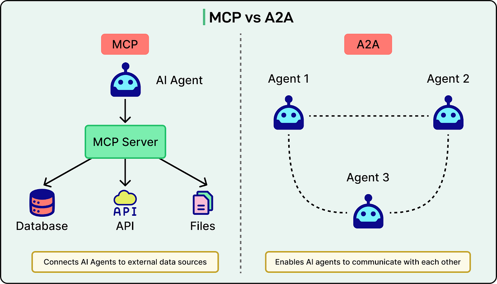
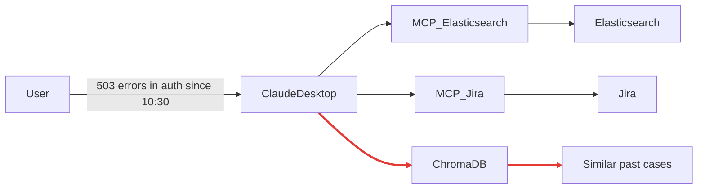

# Goal

The Intelligent Error Diagnosis and Monitoring System (IEMS), AI-powered diagnostic platform that extends our existing Splunk-Jira correlation system. It provides comprehensive, context-aware error analysis through natural language queries, significantly reducing Mean Time to Diagnosis (MTTD) and Mean Time to Resolution (MTTR).

# Current state

These scripts form a solid POC for an interactive correlation client that bridges log sources (Splunk/Elasticsearch) and ticket systems (Jira) using MCP (Model Context Protocol), with LLM integration for query processing and a Claude Desktop-style CLI.





## Key Weaknesses & Opportunities

- **Multi-Step Planning & Execution**: Currently absent. Queries are processed in a single pass (parse → fetch data → correlate → report). No dynamic planning (e.g., breaking "analyze outages" into steps like "fetch logs → check tickets → synthesize"), no HITL (human-in-the-loop) pauses, and no adaptation (e.g., re-planning if data is incomplete).
- **State management** is basic (e.g., conversation_history list)—fine for POC, but scales poorly for multi-turn diagnostics.
- Tool Limitations: MCP tools are called directly, but no abstraction for parallelism (eg., asyncio.gather for simultaneous Splunk + Jira calls). No RAG integration yet.

To add "Multi-Step Planning & Execution" with HITL(Human In The Loop), we can enhance it without overcomplicating—using LangChain for chains/agents.

> **Why Multi-Step?** Real-world diagnostics aren't linear. A query like "Why is the auth service failing?" might require 5+ steps: extract timeframe, search logs, check related tickets, analyze metrics, synthesize root cause.

# Enhancements

Build and autonomous agents which can perceive, reason, plan, act, and learn — with minimal human intervention.
It goes **beyond chatbots** or **function calling** — it’s a **self-directed AI coworker** that can:

- Break down complex goals
- Use tools (APIs, MCP,RAG databases, files)
- Remember context
- Ask clarifying questions
- Make decisions
- Iterate until success

**Real-World Analogies**
**Engineer**: Reads error → checks logs → finds ticket → opens PR
**On-Call SRE**: Gets alert → correlates logs/metrics → pages team
**Data Analyst** :Gets request → pulls data → builds chart → writes report

## Suggested Improvements:

"Multi-Step Planning & Execution" is a core component of the agentic architecture. It's what transforms your system from a simple `query-response tool` into an autonomous, reasoning "AI SRE" that can handle complex diagnostic workflows—analyzing Splunk/Elasticsearch logs, correlating with Jira tickets, and identifying issues—while incorporating human-in-the-loop (HITL) for safety and accuracy.

To keep structure simple:

**Core Idea**: Add a MultiStepPlanner class that uses LangChain to:

- Decompose query (as in your parser, enhanced with LLM).
- Plan steps (LLM-generated list).
- Execute chain of tools (MCP calls).
- Verify & HITL (pause for user input if needed).
- Guardrails: Add verification LLM to check for hallucinations before HITL.

**Frameworks(Considerations):**

- CrewAI: Simpler for multi-agent teams (e.g., LogAgent, TicketAgent).
- AutoGen: Good for conversational HITL.
- LlamaIndex Workflows: If RAG-heavy.
- Langchain

# Example

## Multi-Step Planning & Execution for Your Use Case

Let's take a user query: "What's causing the auth service outages in the last hour? Check logs and tickets."

### `Step 1`: Query Understanding (Decomposition)

LLM Prompt: "Decompose this query: Extract service, error type, timeframe, required data sources, and any ambiguities."

```json
{
  "service": "auth",
  "error_type": "outage",
  "time_range": { "start": "2025-10-28T11:00:00", "end": "now" },
  "data_sources": ["logs (Splunk/Elasticsearch)", "tickets (Jira)"],
  "ambiguities": ["What metrics to check? Confirm if needed."]
}
```

If ambiguous (e.g., no timeframe), HITL: "What timeframe do you mean? Last hour?"

### `Step 2`: Planning

LLM Prompt: "Create a 4-6 step plan for diagnosing auth outages. Use available tools: Splunk MCP, Elasticsearch MCP, Jira MCP. Include HITL for confirmation."
Output Plan (as JSON for structure):

```json
{
  "steps": [
    {"step": 1, "action": "Fetch logs from Splunk/Elasticsearch for 'auth' service in last hour.", "tools": ["Splunk MCP", "Elasticsearch MCP"], "parallel": true},
    {"step": 2, "action": "Search Jira for related tickets on 'auth outage' in last hour.", "tools": ["Jira MCP"]},
    {"step": 3, "action": "Correlate logs with tickets (e.g., match error codes).", "tools": ["LLM synthesizer"]},
    {"step": 4, "action": "HITL: Present preliminary findings and ask if more data (e.g., GitHub PRs) needed.", "hitl": true},
    {"step": 5, "action": "Synthesize root cause (e.g., DB pool exhaustion).", "tools": ["Knowledge Synthesizer LLM"]},
    {"step": 6, "action": "Generate report with resolution suggestions.", "tools": ["Report Generator LLM"]}
  ],
  "dependencies": [2 depends on 1],
  "hitl_points": [4]
}
```

### Step 3: Execution

The system runs the plan step-by-step, calling tools in parallel where possible (e.g., querying logs and tickets simultaneously via MCP). It collects evidence and feeds it back into the LLM for refinement.

- Orchestrator runs steps: - Parallel: Call Splunk/Elasticsearch MCP (search_logs(query="auth outage", time_range="last hour")) and Jira MCP (search_tickets(jql="project=AUTH AND text~'outage' AND created > -1h")). - Collect Evidence: Logs show "connection pool exhausted"; tickets match JIRA-123. - HITL at Step 4: "Found pool exhaustion in logs, matching JIRA-123. Check GitHub too? (Y/N)"
  If user says Y, re-plan: Add step for GitHub MCP.

### Step 4: Verification & Adaptation

- LLM checks: "Is evidence consistent? Confidence: 85%."
- If low, HITL: "Evidence incomplete—provide more details?"
- Final Output: Structured report (as in docs).

This flow ensures the LLM "thinks like an engineer" while keeping humans in control.

## What is an AI agent?

While there isn’t a widely accepted definition for LLM-powered agents, they can be described as a system that can use an LLM to reason through a problem, create a plan to solve the problem, and execute the plan with the help of a set of tools.

An agent is made up of the following key components (more details on these shortly):

Agent core
Memory module
Tools
Planning module
