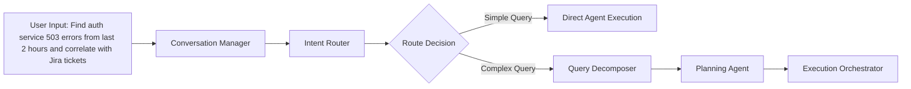

# Intent Router vs Query Decomposer: Detailed Component Comparison

## 🎯 Executive Summary

The **Intent Router** and **Query Decomposer** are two distinct but complementary components in the agentic system architecture. While they both process user input, they serve fundamentally different purposes in the query processing pipeline.

---

## 🔄 High-Level Processing Flow



---

## 🧭 Intent Router: The "What" Component

### Purpose

The **Intent Router** is responsible for **understanding what the user wants to achieve** and **deciding how to process the request**. It acts as the central intelligence hub that determines the appropriate processing strategy.

### Core Responsibilities

| Responsibility            | Description                   | Output                                            |
| ------------------------- | ----------------------------- | ------------------------------------------------- |
| **Intent Classification** | Determine user's primary goal | Intent type (e.g., CORRELATION_ANALYSIS)          |
| **Complexity Assessment** | Evaluate query complexity     | Complexity level (simple/moderate/complex)        |
| **Workflow Selection**    | Choose processing approach    | Processing strategy (direct/multi-step/emergency) |
| **Resource Planning**     | Identify required systems     | List of agents and data sources needed            |

### Example Processing

**Input Query**: `"Find auth service 503 errors from last 2 hours and correlate with Jira tickets"`

**Intent Router Analysis**:

```json
{
  "intent_classification": {
    "primary_intent": "CORRELATION_ANALYSIS",
    "confidence": 0.95,
    "secondary_intents": ["LOG_ANALYSIS", "TICKET_ANALYSIS"]
  },
  "complexity_assessment": {
    "level": "COMPLEX",
    "reasoning": "Requires multi-system integration (logs + tickets)",
    "estimated_steps": 4
  },
  "workflow_selection": {
    "strategy": "MULTI_STEP_WORKFLOW",
    "routing_decision": "ROUTE_TO_QUERY_DECOMPOSER",
    "reason": "Complex correlation requiring planning and coordination"
  },
  "resource_requirements": {
    "required_agents": [
      "LogAnalysisAgent",
      "TicketAnalysisAgent",
      "CorrelationEngine"
    ],
    "data_sources": ["splunk", "jira"],
    "estimated_duration": "90-120 seconds",
    "priority": "medium"
  }
}
```

---

## 🔬 Query Decomposer: The "How" Component

### Purpose

The **Query Decomposer** is responsible for **breaking down complex queries into structured, executable components**. It takes high-level user intent and converts it into detailed operational specifications.

### Core Responsibilities

| Responsibility          | Description                        | Output                           |
| ----------------------- | ---------------------------------- | -------------------------------- |
| **Entity Extraction**   | Extract services, systems, metrics | Structured entities list         |
| **Temporal Analysis**   | Parse time ranges and patterns     | Normalized time specifications   |
| **Operation Mapping**   | Define specific operations needed  | Executable operation definitions |
| **Dependency Analysis** | Identify operation dependencies    | Execution dependency graph       |

### Example Processing

**Same Input Query**: `"Find auth service 503 errors from last 2 hours and correlate with Jira tickets"`

**Query Decomposer Analysis**:

```json
{
  "entities": {
    "services": ["auth-service"],
    "error_types": ["503", "HTTP_503_SERVICE_UNAVAILABLE"],
    "time_range": {
      "start": "-2h",
      "end": "now",
      "normalized_start": "2025-11-03T08:00:00Z",
      "normalized_end": "2025-11-03T10:00:00Z"
    },
    "systems": ["logs", "tickets"]
  },
  "operations": [
    {
      "id": "op_1",
      "type": "log_search",
      "agent": "LogAnalysisAgent",
      "target_system": "splunk",
      "parameters": {
        "service": "auth-service",
        "error_codes": ["503"],
        "time_range": "-2h",
        "search_query": "service=auth-service status=503"
      },
      "expected_output": "list_of_log_events",
      "estimated_duration": "30s"
    },
    {
      "id": "op_2",
      "type": "ticket_search",
      "agent": "TicketAnalysisAgent",
      "target_system": "jira",
      "parameters": {
        "correlation_source": "op_1_results",
        "time_window": "±30min_from_errors",
        "search_strategy": "semantic_correlation"
      },
      "dependencies": ["op_1"],
      "expected_output": "list_of_related_tickets",
      "estimated_duration": "45s"
    },
    {
      "id": "op_3",
      "type": "correlation_analysis",
      "agent": "CorrelationEngine",
      "parameters": {
        "log_events": "op_1_results",
        "tickets": "op_2_results",
        "correlation_method": "semantic_temporal"
      },
      "dependencies": ["op_1", "op_2"],
      "expected_output": "correlation_report",
      "estimated_duration": "60s"
    }
  ],
  "execution_constraints": {
    "parallel_operations": ["op_1"],
    "sequential_dependencies": {
      "op_2": ["op_1"],
      "op_3": ["op_1", "op_2"]
    },
    "success_criteria": {
      "min_log_events": 1,
      "min_correlation_confidence": 0.7
    }
  }
}
```

---

## 🔀 Key Differences

| Aspect                  | Intent Router                         | Query Decomposer                                 |
| ----------------------- | ------------------------------------- | ------------------------------------------------ |
| **Primary Focus**       | Understanding user intent             | Breaking down execution details                  |
| **Input**               | Raw user query + conversation context | User query + classified intent                   |
| **Output**              | Routing decision + resource plan      | Structured operation specifications              |
| **Processing Level**    | High-level strategic decisions        | Low-level operational planning                   |
| **Complexity Handling** | Determines if query is complex        | Handles how complex queries are executed         |
| **LLM Usage**           | Classification and routing logic      | Detailed parsing and structuring                 |
| **When It Runs**        | Every user query                      | Only for complex queries routed by Intent Router |

---

## 📊 Processing Examples by Query Type

### Example 1: Simple Query

**User Input**: `"Show me the last 10 auth service errors"`

#### Intent Router Processing:

```json
{
  "intent": "SIMPLE_LOOKUP",
  "complexity": "SIMPLE",
  "routing_decision": "DIRECT_EXECUTION",
  "target_agent": "LogAnalysisAgent",
  "bypass_decomposer": true
}
```

#### Result: Query goes directly to LogAnalysisAgent

**Query Decomposer**: Not invoked (bypassed for simple queries)

---

### Example 2: Complex Multi-System Query

**User Input**: `"Analyze payment service performance issues from yesterday, correlate with recent deployments and related tickets, then create a summary report"`

#### Intent Router Processing:

```json
{
  "intent": "ROOT_CAUSE_INVESTIGATION",
  "complexity": "VERY_COMPLEX",
  "routing_decision": "MULTI_STEP_WORKFLOW",
  "required_agents": [
    "LogAnalysisAgent",
    "PerformanceAnalysisAgent",
    "TicketAnalysisAgent",
    "DeploymentAnalysisAgent"
  ],
  "estimated_phases": 5
}
```

#### Query Decomposer Processing:

```json
{
  "entities": {
    "services": ["payment-service"],
    "analysis_types": ["performance", "errors", "deployments"],
    "time_range": "yesterday",
    "output_format": "summary_report"
  },
  "operations": [
    {
      "id": "op_1",
      "type": "performance_analysis",
      "agent": "PerformanceAnalysisAgent",
      "parameters": {
        "service": "payment-service",
        "metrics": ["response_time", "error_rate", "throughput"],
        "time_range": "yesterday"
      }
    },
    {
      "id": "op_2",
      "type": "log_analysis",
      "agent": "LogAnalysisAgent",
      "parameters": {
        "service": "payment-service",
        "log_levels": ["ERROR", "WARN"],
        "time_range": "yesterday"
      }
    },
    {
      "id": "op_3",
      "type": "deployment_analysis",
      "agent": "DeploymentAnalysisAgent",
      "parameters": {
        "service": "payment-service",
        "time_range": "last_week",
        "deployment_correlation": true
      }
    },
    {
      "id": "op_4",
      "type": "ticket_correlation",
      "agent": "TicketAnalysisAgent",
      "dependencies": ["op_1", "op_2"],
      "parameters": {
        "correlation_data": ["op_1_results", "op_2_results"],
        "ticket_systems": ["jira", "servicenow"]
      }
    },
    {
      "id": "op_5",
      "type": "report_generation",
      "agent": "ReportGenerator",
      "dependencies": ["op_1", "op_2", "op_3", "op_4"],
      "parameters": {
        "report_type": "root_cause_analysis",
        "include_recommendations": true
      }
    }
  ],
  "execution_plan": {
    "phase_1": ["op_1", "op_2", "op_3"], // Parallel data collection
    "phase_2": ["op_4"], // Correlation (depends on phase 1)
    "phase_3": ["op_5"] // Report generation (depends on all)
  }
}
```

---

## 🤝 How They Work Together

### Workflow Collaboration:

1. **Intent Router** receives user query

   - Classifies intent and assesses complexity
   - Decides if query needs decomposition
   - Routes simple queries directly to agents
   - Routes complex queries to Query Decomposer

2. **Query Decomposer** (for complex queries)

   - Receives classified intent from Intent Router
   - Breaks down query into structured operations
   - Creates detailed execution specifications
   - Passes structured plan to Planning Agent

3. **Planning Agent**
   - Takes decomposed operations
   - Creates optimized execution plan
   - Handles resource allocation and scheduling

### Real-World Analogy:

Think of **Intent Router** as a **restaurant host** who:

- Understands what type of dining experience you want
- Decides which section of restaurant to seat you
- Determines if you need a simple table or private room

Think of **Query Decomposer** as a **head chef** who:

- Takes your complex meal order
- Breaks it down into individual cooking tasks
- Specifies ingredients, cooking times, and sequence
- Creates detailed instructions for the kitchen staff

---

## 💡 When Each Component Is Used

### Intent Router is ALWAYS used for:

- Every single user query
- Initial intent classification
- Routing decisions
- Resource requirement estimation

### Query Decomposer is ONLY used for:

- Complex multi-step queries
- Queries requiring multiple agents/systems
- Queries with temporal complexity
- Queries needing correlation analysis

### Example Decision Tree:

```
User Query → Intent Router
    ├── Simple Query (e.g., "Show logs") → Direct Agent Execution
    ├── Moderate Query (e.g., "Count errors") → Simple Multi-Agent
    └── Complex Query (e.g., "Analyze + Correlate + Report") → Query Decomposer
```

---

## 🎯 Summary

| Component            | Answers                       | Examples                                       |
| -------------------- | ----------------------------- | ---------------------------------------------- |
| **Intent Router**    | "What does the user want?"    | "User wants correlation analysis"              |
|                      | "How complex is this?"        | "This requires 3 systems and 5 steps"          |
|                      | "What's the best approach?"   | "Route to multi-step workflow"                 |
| **Query Decomposer** | "What are the exact steps?"   | "Step 1: Search logs, Step 2: Find tickets..." |
|                      | "What are the dependencies?"  | "Ticket search depends on log results"         |
|                      | "What parameters are needed?" | "Time range: -2h, Service: auth, Error: 503"   |

The **Intent Router** is the strategic decision maker, while the **Query Decomposer** is the tactical execution planner. They work together to transform natural language queries into executable multi-agent workflows.
