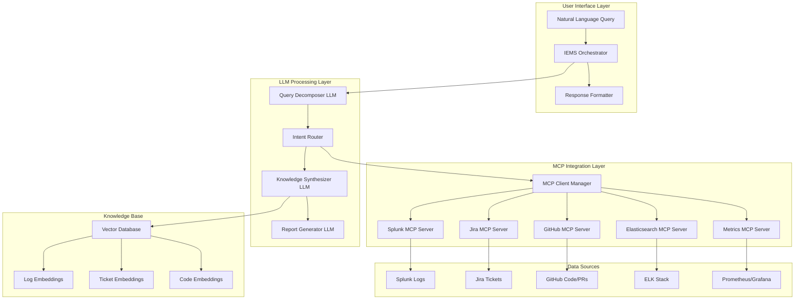

# Intelligent Error Diagnosis and Monitoring System (IEMS)

## Design Document & Architecture

### Executive Summary

The **Intelligent Error Diagnosis and Monitoring System (IEMS)** is a next-generation, AI-powered diagnostic platform that extends our existing Splunk-Jira correlation system. It provides comprehensive, context-aware error analysis through natural language queries, significantly reducing Mean Time to Diagnosis (MTTD) and Mean Time to Resolution (MTTR).

**Key Objectives:**

- **MTTD Reduction**: From hours to minutes through intelligent correlation

- **MTTR Acceleration**: Automated root cause analysis and resolution suggestions

- **Contextual Intelligence**: Deep semantic understanding beyond keyword matching

- **Extensible Architecture**: Plug-and-play integration for new data sources

---

## 📚 Document Index & Navigation

### 🗂️ Quick Navigation

| Section | Description | Key Topics |
|---------|-------------|------------|
| [Executive Summary](#executive-summary) | High-level overview and objectives | MTTD/MTTR goals, key benefits |
| [System Architecture](#system-architecture) | Core system design and data flow | Architecture diagrams, component interaction |
| [LLM Strategy & Component Design](#llm-strategy--component-design) | AI/ML strategy and model selection | Multi-LLM architecture, agentic workflows |
| [Enhanced MCP Integration Architecture](#enhanced-mcp-integration-architecture) | MCP server ecosystem and protocols | Extended MCP servers, parallel execution |
| [RAG & Knowledge Management Strategy](#rag--knowledge-management-strategy) | RAG and vector database strategy | Embedding strategies, knowledge storage |
| [Query Processing Pipeline](#query-processing-pipeline) | Natural language query handling | Query decomposition, tool execution |
| [Knowledge Synthesis & Report Generation](#knowledge-synthesis--report-generation) | Evidence correlation and report generation | Multi-source correlation, intelligent reports |
| [Implementation Strategy](#implementation-strategy) | Development phases and timelines | 4-phase implementation roadmap |
| [Success Metrics & KPIs](#success-metrics--kpis) | KPIs and measurement criteria | MTTD, MTTR, accuracy targets |
| [Security & Compliance Considerations](#security--compliance-considerations) | Security framework and compliance | Access controls, data classification |
| [Technology Stack & Dependencies](#technology-stack--dependencies) | Core technologies and dependencies | LangChain, MCP, vector databases |
| [Future Enhancements & Roadmap](#future-enhancements--roadmap) | Enhancement opportunities | Short-term and long-term features |
| [Glossary & Terminology](#glossary--terminology) | Technical terms and definitions | Complete terminology reference |

> 💡 **Navigation Note**: Links work universally across GitHub, Obsidian, VS Code, and other markdown editors

---

## System Architecture

### High-Level Architecture



### Extended Data Flow

```
┌─────────────────┐    ┌─────────────────┐    ┌─────────────────┐
│ "Auth service   │───▶│ Query Decomposer│───▶│ Intent Router   │
│ 503 errors      │    │ LLM             │    │                 │
│ since 10:30 AM" │    └─────────────────┘    └─────────────────┘
└─────────────────┘                                    │
                                                       ▼
┌─────────────────────────────────────────────────────────────────┐
│                 Parallel MCP Tool Execution                    │
├─────────────────┬─────────────────┬─────────────────┬─────────┤
│   Splunk MCP    │   Jira MCP      │  GitHub MCP     │ ELK MCP │
│ ┌─────────────┐ │ ┌─────────────┐ │ ┌─────────────┐ │ ┌─────┐ │
│ │ Temporal    │ │ │ Ticket      │ │ │ Recent PRs  │ │ │ Logs│ │
│ │ Log Search  │ │ │ Search      │ │ │ Code Changes│ │ │ Agg │ │
│ └─────────────┘ │ └─────────────┘ │ └─────────────┘ │ └─────┘ │
└─────────────────┴─────────────────┴─────────────────┴─────────┘
                                    │
                                    ▼
┌─────────────────────────────────────────────────────────────────┐
│              Knowledge Synthesis & RAG Engine                  │
│ ┌─────────────────┐ ┌─────────────────┐ ┌─────────────────┐    │
│ │ Semantic        │ │ Root Cause      │ │ Resolution      │    │
│ │ Correlation     │ │ Analysis        │ │ Recommendation  │    │
│ └─────────────────┘ └─────────────────┘ └─────────────────┘    │
└─────────────────────────────────────────────────────────────────┘
                                    │
                                    ▼
┌─────────────────────────────────────────────────────────────────┐
│                 Comprehensive Diagnostic Report                │
│ • Root Cause: Authentication DB connection pool exhaustion     │
│ • Evidence: [Log snippets, Related tickets, Recent PRs]       │
│ • Resolution: Scale DB connections, Apply hotfix PR #1234     │
│ • Timeline: Issue started 10:28 AM, Similar issue: TICKET-567 │
└─────────────────────────────────────────────────────────────────┘
```

---

## LLM Strategy & Component Design

### 1. **Multi-LLM Architecture**

```python
class IEMSOrchestrator:
    def __init__(self):
        # Specialized LLMs for different tasks
        self.query_decomposer = LLMClient(
            model="gpt-4-turbo",  # Large context for complex queries
            temperature=0.1,      # Precise extraction
            max_tokens=1000
        )

        self.knowledge_synthesizer = LLMClient(
            model="gpt-4o",       # Multimodal for charts/logs
            temperature=0.3,      # Balanced creativity
            max_tokens=4000
        )

        self.report_generator = LLLMClient(
            model="gpt-4",        # Structured output
            temperature=0.2,      # Consistent formatting
            max_tokens=2000
        )
```

**LLM Selection Rationale:**

| Component                 | Model             | Justification                                      |
| ------------------------- | ----------------- | -------------------------------------------------- |
| **Query Decomposer**      | GPT-4 Turbo       | Large context window for complex technical queries |
| **Knowledge Synthesizer** | GPT-4o            | Multimodal capabilities for log analysis & charts  |
| **Report Generator**      | GPT-4             | Structured output generation & formatting          |
| **Fallback**              | Claude-3.5 Sonnet | Alternative for high-availability scenarios        |

### 2. **Agentic Workflow with LangChain**

```python
from langchain.agents import create_openai_tools_agent
from langchain.tools import StructuredTool
from langchain.schema import AgentAction

class IEMSAgent:
    def __init__(self):
        self.tools = [
            SplunkSearchTool(),
            JiraSearchTool(),
            GitHubAnalysisTool(),
            ElasticsearchTool(),
            MetricsAnalysisTool(),
            VectorSimilarityTool()
        ]

        self.agent = create_openai_tools_agent(
            llm=self.knowledge_synthesizer,
            tools=self.tools,
            prompt=self._create_system_prompt()
        )

    async def diagnose_error(self, user_query: str) -> DiagnosticReport:
        """
        Agentic workflow for error diagnosis

        WORKFLOW:
        1. Query decomposition → Extract metadata
        2. Parallel tool execution → Gather evidence
        3. Semantic correlation → Find relationships
        4. Root cause analysis → Determine causality
        5. Resolution synthesis → Generate actionable steps
        """

        # Step 1: Decompose query
        metadata = await self._decompose_query(user_query)

        # Step 2: Execute parallel tools
        evidence = await self._gather_evidence(metadata)

        # Step 3: Synthesize knowledge
        analysis = await self._synthesize_analysis(evidence)

        # Step 4: Generate report
        report = await self._generate_report(analysis)

        # Step 5: Store for future RAG
        await self._store_embeddings(user_query, evidence, report)

        return report
```

---

## Enhanced MCP Integration Architecture

### 1. **Extended MCP Server Ecosystem**

Building on your existing Splunk-Jira MCP architecture:

```python
class EnhancedMCPManager:
    """
    Manages multiple MCP connections for comprehensive data access
    """

    def __init__(self):
        self.mcp_servers = {
            # Existing servers (from current system)
            'splunk': SplunkMCPServer(transport='http_sse'),
            'jira': JiraMCPServer(transport='docker_stdio'),

            # New IEMS servers
            'github': GitHubMCPServer(transport='http_rest'),
            'elasticsearch': ElasticsearchMCPServer(transport='http_rest'),
            'prometheus': PrometheusMCPServer(transport='http_rest'),
            'datadog': DatadogMCPServer(transport='http_rest'),
            'kubernetes': KubernetesMCPServer(transport='kubectl_stdio'),
            'vector_db': ChromaDBMCPServer(transport='http_rest')
        }

    async def execute_parallel_queries(self, query_plan: Dict) -> Dict[str, Any]:
        """
        Execute queries across multiple MCP servers in parallel
        """
        tasks = []

        for server_name, query_config in query_plan.items():
            if server_name in self.mcp_servers:
                task = self._execute_mcp_query(
                    server=self.mcp_servers[server_name],
                    config=query_config
                )
                tasks.append((server_name, task))

        # Execute all queries concurrently
        results = await asyncio.gather(*[task for _, task in tasks])

        return dict(zip([name for name, _ in tasks], results))
```

### 2. **New MCP Server Specifications**

#### GitHub MCP Server

```json
{
  "name": "github_mcp_server",
  "tools": [
    {
      "name": "search_recent_commits",
      "description": "Search commits by timeframe, author, or file path",
      "parameters": {
        "repository": "string",
        "since": "ISO datetime",
        "until": "ISO datetime",
        "path": "string (optional)",
        "author": "string (optional)"
      }
    },
    {
      "name": "analyze_pr_changes",
      "description": "Analyze pull request changes for potential error sources",
      "parameters": {
        "pr_number": "integer",
        "repository": "string"
      }
    },
    {
      "name": "search_issues_by_error",
      "description": "Find GitHub issues related to error patterns",
      "parameters": {
        "error_pattern": "string",
        "labels": "array of strings",
        "state": "open|closed|all"
      }
    }
  ]
}
```

#### Elasticsearch MCP Server

```json
{
  "name": "elasticsearch_mcp_server",
  "tools": [
    {
      "name": "aggregate_error_patterns",
      "description": "Aggregate error patterns over time windows",
      "parameters": {
        "index_pattern": "string",
        "time_range": "string",
        "aggregation_type": "count|avg|max|min",
        "group_by": "array of fields"
      }
    },
    {
      "name": "anomaly_detection",
      "description": "Detect anomalous error rates or patterns",
      "parameters": {
        "metric_field": "string",
        "baseline_period": "string",
        "sensitivity": "low|medium|high"
      }
    }
  ]
}
```

#### Metrics MCP Server (Prometheus/Grafana)

```json
{
  "name": "metrics_mcp_server",
  "tools": [
    {
      "name": "query_service_metrics",
      "description": "Query service performance metrics during error timeframe",
      "parameters": {
        "service_name": "string",
        "metric_names": "array of strings",
        "time_range": "string",
        "resolution": "string"
      }
    },
    {
      "name": "correlate_infrastructure_metrics",
      "description": "Correlate infrastructure metrics with error patterns",
      "parameters": {
        "error_timeframe": "string",
        "infrastructure_components": "array of strings"
      }
    }
  ]
}
```

---

## RAG & Knowledge Management Strategy

### 1. **Multi-Modal Embedding Strategy**

```python
class IEMSKnowledgeBase:
    """
    Comprehensive knowledge base with semantic search capabilities
    """

    def __init__(self):
        self.vector_store = ChromaDB(
            collection_name="iems_knowledge",
            embedding_function=SentenceTransformers("all-mpnet-base-v2")
        )

        self.embedding_strategies = {
            'log_entries': LogEmbeddingStrategy(),
            'jira_tickets': JiraEmbeddingStrategy(),
            'code_changes': CodeEmbeddingStrategy(),
            'metrics_data': MetricsEmbeddingStrategy(),
            'diagnostic_reports': ReportEmbeddingStrategy()
        }

    async def store_diagnostic_case(self,
                                   user_query: str,
                                   evidence: Dict[str, Any],
                                   resolution: DiagnosticReport) -> str:
        """
        Store complete diagnostic case for future RAG retrieval
        """

        # Create comprehensive embedding
        case_embedding = await self._create_case_embedding(
            query=user_query,
            evidence=evidence,
            resolution=resolution
        )

        # Store with rich metadata
        case_id = await self.vector_store.add_document(
            embedding=case_embedding,
            metadata={
                'timestamp': datetime.utcnow().isoformat(),
                'error_type': resolution.error_classification,
                'affected_services': resolution.affected_services,
                'resolution_time': resolution.resolution_time,
                'confidence_score': resolution.confidence_score,
                'root_cause_category': resolution.root_cause_category
            },
            content={
                'original_query': user_query,
                'evidence_summary': evidence,
                'diagnostic_report': resolution.to_dict()
            }
        )

        return case_id

    async def retrieve_similar_cases(self,
                                   query: str,
                                   k: int = 5) -> List[DiagnosticCase]:
        """
        Retrieve similar diagnostic cases for RAG enhancement
        """

        query_embedding = await self._embed_query(query)

        similar_cases = await self.vector_store.similarity_search(
            query_vector=query_embedding,
            k=k,
            filter_metadata={
                'confidence_score': {'$gte': 0.7}  # High-confidence cases only
            }
        )

        return [DiagnosticCase.from_dict(case.content) for case in similar_cases]
```

### 2. **Embedding Strategy for Different Data Types**

| Data Type              | Embedding Model                           | Strategy                             |
| ---------------------- | ----------------------------------------- | ------------------------------------ |
| **Log Entries**        | `sentence-transformers/all-mpnet-base-v2` | Semantic content + temporal context  |
| **Jira Tickets**       | `text-embedding-ada-002`                  | Issue description + resolution steps |
| **Code Changes**       | `microsoft/codebert-base`                 | Code semantics + commit messages     |
| **Error Patterns**     | `all-MiniLM-L6-v2`                        | Error signatures + context           |
| **Diagnostic Reports** | `text-embedding-ada-002`                  | Full report content + metadata       |

---

## Query Processing Pipeline

### 1. **Advanced Query Decomposition**

```python
class QueryDecomposer:
    """
    LLM-powered query decomposition with structured output
    """

    def __init__(self):
        self.llm = ChatOpenAI(model="gpt-4-turbo", temperature=0.1)
        self.parser = PydanticOutputParser(pydantic_object=QueryMetadata)

    async def decompose_query(self, user_query: str) -> QueryMetadata:
        """
        Extract structured metadata from natural language query

        Examples:
        Input: "Auth service failing with 503 errors since 10:30 AM UTC"
        Output: {
            "services": ["auth-service"],
            "error_codes": ["503"],
            "time_range": {
                "start": "2024-10-13T10:30:00Z",
                "end": "now"
            },
            "severity": "high",
            "error_type": "http_error",
            "intent": "diagnosis"
        }
        """

        prompt = ChatPromptTemplate.from_template("""
        Analyze this error query and extract structured metadata:

        Query: {query}

        Extract the following information:
        1. Affected services/components
        2. Error codes or types
        3. Time range (convert relative times to absolute)
        4. Severity level
        5. Primary intent (diagnosis, monitoring, investigation)
        6. Related keywords for search

        {format_instructions}
        """)

        chain = prompt | self.llm | self.parser
        return await chain.ainvoke({
            "query": user_query,
            "format_instructions": self.parser.get_format_instructions()
        })

@dataclass
class QueryMetadata:
    services: List[str]
    error_codes: List[str]
    time_range: Dict[str, str]
    severity: str
    error_type: str
    intent: str
    search_keywords: List[str]
    confidence: float
```

### 2. **Intelligent Tool Selection & Execution**

```python
class ToolExecutionPlanner:
    """
    Plans and executes optimal tool combinations based on query analysis
    """

    def __init__(self):
        self.execution_strategies = {
            'http_error': [
                'splunk_search', 'elasticsearch_aggregate',
                'metrics_query', 'jira_search'
            ],
            'database_error': [
                'splunk_search', 'metrics_query',
                'jira_search', 'github_search'
            ],
            'authentication_error': [
                'splunk_search', 'jira_search',
                'github_security_search', 'metrics_query'
            ],
            'performance_degradation': [
                'metrics_query', 'elasticsearch_anomaly',
                'splunk_search', 'kubernetes_logs'
            ]
        }

    def create_execution_plan(self, metadata: QueryMetadata) -> ExecutionPlan:
        """
        Create optimized execution plan based on error type and query metadata
        """

        base_tools = self.execution_strategies.get(
            metadata.error_type,
            ['splunk_search', 'jira_search']  # fallback
        )

        plan = ExecutionPlan(
            primary_tools=base_tools,
            parallel_execution=True,
            timeout_seconds=30,
            fallback_enabled=True
        )

        # Add tool-specific configurations
        for tool_name in base_tools:
            plan.add_tool_config(
                tool_name=tool_name,
                config=self._generate_tool_config(tool_name, metadata)
            )

        return plan

    def _generate_tool_config(self, tool_name: str, metadata: QueryMetadata) -> Dict:
        """Generate tool-specific configuration based on query metadata"""

        configs = {
            'splunk_search': {
                'query': self._build_splunk_query(metadata),
                'time_range': metadata.time_range,
                'max_results': 100
            },
            'jira_search': {
                'jql': self._build_jira_jql(metadata),
                'fields': ['summary', 'description', 'status', 'resolution']
            },
            'github_search': {
                'repositories': metadata.services,
                'time_range': metadata.time_range,
                'search_type': 'commits_and_issues'
            },
            'metrics_query': {
                'services': metadata.services,
                'metrics': ['error_rate', 'response_time', 'throughput'],
                'time_range': metadata.time_range
            }
        }

        return configs.get(tool_name, {})
```

---

## Knowledge Synthesis & Report Generation

### 1. **Multi-Source Correlation Engine**

```python
class KnowledgeSynthesizer:
    """
    Advanced correlation engine using LLM for semantic understanding
    """

    def __init__(self):
        self.llm = ChatOpenAI(model="gpt-4o", temperature=0.3)
        self.correlation_strategies = [
            TemporalCorrelationStrategy(),
            SemanticCorrelationStrategy(),
            CausalCorrelationStrategy(),
            PatternCorrelationStrategy()
        ]

    async def synthesize_evidence(self,
                                 evidence: Dict[str, Any],
                                 query_metadata: QueryMetadata) -> AnalysisResult:
        """
        Synthesize evidence from multiple sources into coherent analysis

        SYNTHESIS PIPELINE:
        1. Temporal correlation → Timeline reconstruction
        2. Semantic correlation → Content relationships
        3. Causal analysis → Root cause determination
        4. Pattern recognition → Similar incidents
        5. Resolution synthesis → Actionable recommendations
        """

        # Step 1: Temporal correlation
        timeline = await self._reconstruct_timeline(evidence)

        # Step 2: Semantic correlation
        relationships = await self._find_semantic_relationships(evidence)

        # Step 3: Root cause analysis
        root_causes = await self._analyze_root_causes(
            evidence, timeline, relationships
        )

        # Step 4: Pattern matching with historical cases
        similar_cases = await self.knowledge_base.retrieve_similar_cases(
            query_metadata.search_keywords
        )

        # Step 5: Resolution synthesis
        recommendations = await self._generate_recommendations(
            root_causes, similar_cases, evidence
        )

        return AnalysisResult(
            timeline=timeline,
            root_causes=root_causes,
            evidence_relationships=relationships,
            similar_cases=similar_cases,
            recommendations=recommendations,
            confidence_score=self._calculate_confidence(evidence)
        )

    async def _analyze_root_causes(self,
                                  evidence: Dict[str, Any],
                                  timeline: Timeline,
                                  relationships: List[Relationship]) -> List[RootCause]:
        """
        LLM-powered root cause analysis with evidence citation
        """

        prompt = ChatPromptTemplate.from_template("""
        Analyze the following evidence to determine the root cause(s) of the reported issue:

        EVIDENCE SUMMARY:
        Splunk Logs: {splunk_evidence}
        Jira Tickets: {jira_evidence}
        GitHub Changes: {github_evidence}
        Metrics Data: {metrics_evidence}

        TIMELINE: {timeline}

        RELATIONSHIPS: {relationships}

        Provide a structured root cause analysis:

        6. PRIMARY ROOT CAUSE:
           - Description: [Clear, technical description]
           - Evidence: [Cite specific logs, tickets, or commits]
           - Confidence: [High/Medium/Low with reasoning]

        2. CONTRIBUTING FACTORS:
           - List secondary factors that amplified the issue
           - Provide evidence for each factor

        3. CAUSAL CHAIN:
           - Show the sequence of events leading to the error
           - Include timestamps and system interactions

        4. IMPACT ASSESSMENT:
           - Affected services and user impact
           - Business criticality and scope

        Be specific and cite evidence. Focus on technical accuracy.
        """)

        response = await self.llm.ainvoke(prompt.format(
            splunk_evidence=evidence.get('splunk', []),
            jira_evidence=evidence.get('jira', []),
            github_evidence=evidence.get('github', []),
            metrics_evidence=evidence.get('metrics', []),
            timeline=timeline.to_dict(),
            relationships=[r.to_dict() for r in relationships]
        ))

        return self._parse_root_cause_analysis(response.content)
```

### 2. **Structured Report Generation**

````python

```python
class DiagnosticReportGenerator:
    """
    Generates comprehensive, actionable diagnostic reports
    """

    def __init__(self):
        self.llm = ChatOpenAI(model="gpt-4", temperature=0.2)
        self.report_templates = {
            'executive_summary': ExecutiveSummaryTemplate(),
            'technical_analysis': TechnicalAnalysisTemplate(),
            'resolution_steps': ResolutionStepsTemplate(),
            'prevention_measures': PreventionMeasuresTemplate()
        }

    async def generate_report(self,
                            analysis: AnalysisResult,
                            query_metadata: QueryMetadata) -> DiagnosticReport:
        """
        Generate comprehensive diagnostic report with multiple sections
        """

        report_sections = {}

        # Generate each section in parallel
        section_tasks = [
            self._generate_executive_summary(analysis, query_metadata),
            self._generate_technical_analysis(analysis),
            self._generate_resolution_steps(analysis),
            self._generate_prevention_measures(analysis),
            self._generate_related_cases(analysis)
        ]

        results = await asyncio.gather(*section_tasks)

        return DiagnosticReport(
            executive_summary=results[0],
            technical_analysis=results[1],
            resolution_steps=results[2],
            prevention_measures=results[3],
            related_cases=results[4],
            metadata=ReportMetadata(
                query=query_metadata.original_query,
                generated_at=datetime.utcnow(),
                confidence_score=analysis.confidence_score,
                evidence_sources=analysis.evidence_sources,
                resolution_time=analysis.estimated_resolution_time
            )
        )

@dataclass
class DiagnosticReport:
    executive_summary: ExecutiveSummary
    technical_analysis: TechnicalAnalysis
    resolution_steps: List[ResolutionStep]
    prevention_measures: List[PreventionMeasure]
    related_cases: List[RelatedCase]
    metadata: ReportMetadata

    def to_markdown(self) -> str:
        """Generate formatted markdown report"""
        return f"""
# 🚨 Diagnostic Report: {self.metadata.issue_title}

## 📊 Executive Summary
{self.executive_summary.to_markdown()}

## 🔍 Technical Analysis
{self.technical_analysis.to_markdown()}

## 🛠️ Resolution Steps
{self._format_resolution_steps()}

## 🛡️ Prevention Measures
{self._format_prevention_measures()}

## 🔗 Related Cases
{self._format_related_cases()}

---
*Report generated at {self.metadata.generated_at} | Confidence: {self.metadata.confidence_score}*
        """
````

---

## Implementation Strategy

### Phase 1: Core Extension (4-6 weeks)

1.  **Extend existing MCP architecture**

- Add GitHub, Elasticsearch, Metrics MCP servers

- Implement parallel execution manager

- Create unified MCP client interface

2.  **Implement query decomposition**

- LLM-powered natural language understanding

- Structured metadata extraction

- Intent classification and routing

3.  **Basic knowledge synthesis**

- Multi-source evidence correlation

- Simple root cause analysis

- Template-based report generation

### Phase 2: Advanced Intelligence (6-8 weeks)

1.  **Implement RAG knowledge base**

- Vector embedding storage

- Semantic similarity search

- Historical case retrieval

2.  **Advanced correlation algorithms**

- Temporal pattern analysis

- Causal relationship detection

- Anomaly correlation

3.  **Intelligent report generation**

- Context-aware recommendations

- Prevention measure suggestions

- Executive summary generation

### Phase 3: Production Optimization (4-6 weeks)

1.  **Performance optimization**

- Async processing pipelines

- Caching strategies

- Load balancing

2.  **Monitoring and observability**

- System health dashboards

- Performance metrics

- Error tracking

3.  **Security and compliance**

- Data access controls

- Audit logging

- Privacy protection

### Phase 4: Advanced Features (6-8 weeks)

1.  **Predictive analysis**

- Proactive issue detection

- Trend analysis

- Capacity planning

2.  **Integration ecosystem**

- Additional data sources

- External tool integrations

- API ecosystem

---

## Success Metrics & KPIs

| Metric                             | Current Baseline | Target Improvement | Measurement Method                                  |
| ---------------------------------- | ---------------- | ------------------ | --------------------------------------------------- |
| **Mean Time to Diagnosis (MTTD)**  | 2-4 hours        | < 15 minutes       | Time from error report to root cause identification |
| **Mean Time to Resolution (MTTR)** | 4-8 hours        | < 1 hour           | Time from error report to issue resolution          |
| **Diagnostic Accuracy**            | 60-70%           | > 90%              | Percentage of correct root cause identifications    |
| **Query Response Time**            | N/A              | < 30 seconds       | Time to generate comprehensive diagnostic report    |
| **User Satisfaction**              | N/A              | > 4.5/5            | User feedback on report quality and usefulness      |
| **Coverage Expansion**             | 2 systems        | 6+ systems         | Number of integrated data sources                   |

---

## Technology Stack & Dependencies

### Core Technologies

```yaml
LLM Framework:
  - LangChain: v0.3+ (orchestration)

  - OpenAI API: GPT-4 family models

  - Anthropic Claude: Fallback and specialized tasks

MCP Integration:
  - Model Context Protocol: v1.0+

  - Custom MCP servers for each data source

  - Async MCP client management

Vector Database:
  - ChromaDB: Primary vector store

  - Sentence Transformers: Embedding models

  - FAISS: High-performance similarity search

Observability:
  - Prometheus: Metrics collection

  - Grafana: Dashboards and visualization

  - OpenTelemetry: Distributed tracing

Infrastructure:
  - FastAPI: REST API framework

  - Docker: Containerization

  - Kubernetes: Orchestration

  - Redis: Caching layer
```

### Integration Dependencies

```yaml
Data Sources:
  - Splunk Enterprise: v9.0+

  - Elasticsearch: v8.0+

  - Jira Server/Cloud: REST API v3

  - GitHub Enterprise: REST API v4

  - Prometheus: v2.40+

  - Kubernetes: v1.28+

Security:
  - OAuth 2.0: Authentication

  - RBAC: Authorization

  - Vault: Secrets management

  - TLS 1.3: Encryption in transit
```

---

## Future Enhancements & Roadmap

### Short Term (6 months)

- **Proactive Monitoring**: Predict issues before they occur

- **Mobile Interface**: Mobile app for on-call engineers

- **Slack Integration**: Real-time notifications and query interface

- **Custom Dashboards**: Personalized monitoring dashboards

---

This comprehensive design provides a robust foundation for the Intelligent Error Diagnosis and Monitoring System, building on your existing Splunk-Jira correlation system while adding significant new capabilities for faster, more accurate error diagnosis and resolution.

---

## Glossary & Terminology

### 🔗 Integration & Protocol Terms

| Term                             | Definition                                                           | Context in IEMS                                                     |
| -------------------------------- | -------------------------------------------------------------------- | ------------------------------------------------------------------- |
| **MCP (Model Context Protocol)** | Standardized protocol for AI model-data source integration           | Foundation protocol for connecting IEMS to multiple data sources    |
| **MCP Server**                   | Server implementation that exposes data source capabilities via MCP  | Each data source (Splunk, Jira, GitHub) has dedicated MCP server    |
| **Parallel Execution**           | Simultaneous execution of multiple operations to improve performance | IEMS queries multiple data sources concurrently for faster results  |
| **Tool Execution**               | Programmatic invocation of specific functions or APIs                | MCP tools are executed to gather evidence from various data sources |
| **Transport Layer**              | Communication method between MCP client and server                   | Supports HTTP/SSE, Docker stdio, kubectl, and REST transports       |

### 📊 Monitoring & Observability Terms

| Term                               | Definition                                                                    | Context in IEMS                                               |
| ---------------------------------- | ----------------------------------------------------------------------------- | ------------------------------------------------------------- |
| **MTTD (Mean Time to Diagnosis)**  | Average time from issue occurrence to root cause identification               | Key metric IEMS aims to reduce from hours to minutes          |
| **MTTR (Mean Time to Resolution)** | Average time from issue occurrence to complete resolution                     | Target metric for measuring IEMS effectiveness                |
| **Root Cause Analysis**            | Process of identifying the fundamental cause of a problem                     | IEMS automates this through multi-source evidence correlation |
| **Temporal Correlation**           | Analysis of time-based relationships between events                           | Identifies event sequences and cascading failures             |
| **Evidence Synthesis**             | Process of combining information from multiple sources into coherent analysis | Core IEMS capability for comprehensive diagnostic reports     |

### AI/ML Terms

| Term                                     | Definition                                                                        | Context in IEMS                                                                |
| ---------------------------------------- | --------------------------------------------------------------------------------- | ------------------------------------------------------------------------------ |
| **Agentic Workflow**                     | AI system that can plan, execute, and adapt sequences of actions autonomously     | IEMS uses agentic workflows to orchestrate multi-step diagnostic processes     |
| **Embedding**                            | Numerical vector representation of text/data that captures semantic meaning       | Used to store and retrieve similar diagnostic cases in vector database         |
| **LLM (Large Language Model)**           | AI model trained on large text datasets to understand and generate human language | Core intelligence layer for query processing and report generation             |
| **RAG (Retrieval-Augmented Generation)** | AI technique combining information retrieval with text generation                 | Enhances diagnostic accuracy by incorporating historical case knowledge        |
| **Semantic Correlation**                 | Relationship analysis based on meaning rather than keyword matching               | Identifies related errors across different systems using context understanding |
| **Vector Database**                      | Database optimized for storing and querying high-dimensional vectors              | Stores diagnostic case embeddings for similarity search and retrieval          |

### 🏗️ Architecture & System Terms

| Term                    | Definition                                                                            | Context in IEMS                                          |
| ----------------------- | ------------------------------------------------------------------------------------- | -------------------------------------------------------- |
| **Circuit Breaker**     | Design pattern that prevents cascading failures by stopping calls to failing services | Protects IEMS from data source outages                   |
| **Orchestrator**        | Central component that coordinates and manages system workflows                       | IEMS Orchestrator manages the entire diagnostic pipeline |
| **Query Decomposition** | Process of breaking down natural language queries into structured metadata            | Enables precise tool selection and execution planning    |
| **Knowledge Base**      | Repository of stored information and learned patterns                                 | Vector database containing historical diagnostic cases   |
| **Multi-Modal**         | Capability to process different types of data (text, logs, metrics, images)           | IEMS handles diverse data formats from multiple sources  |

### 🔍 Data Processing Terms

| Term                    | Definition                                                     | Context in IEMS                                              |
| ----------------------- | -------------------------------------------------------------- | ------------------------------------------------------------ |
| **Anomaly Detection**   | Identification of patterns that deviate from normal behavior   | Used to identify unusual error rates or system behaviors     |
| **Causal Analysis**     | Determination of cause-and-effect relationships between events | Identifies how one event triggers subsequent failures        |
| **Evidence Gathering**  | Collection of relevant data from multiple sources              | Parallel collection from Splunk, Jira, GitHub, metrics, etc. |
| **Pattern Recognition** | Identification of recurring structures or behaviors in data    | Matches current issues with historical incident patterns     |
| **Trend Analysis**      | Analysis of data patterns over time to identify trajectories   | Predicts capacity issues and emerging problems               |
